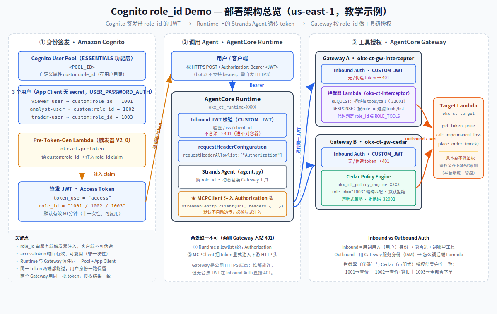
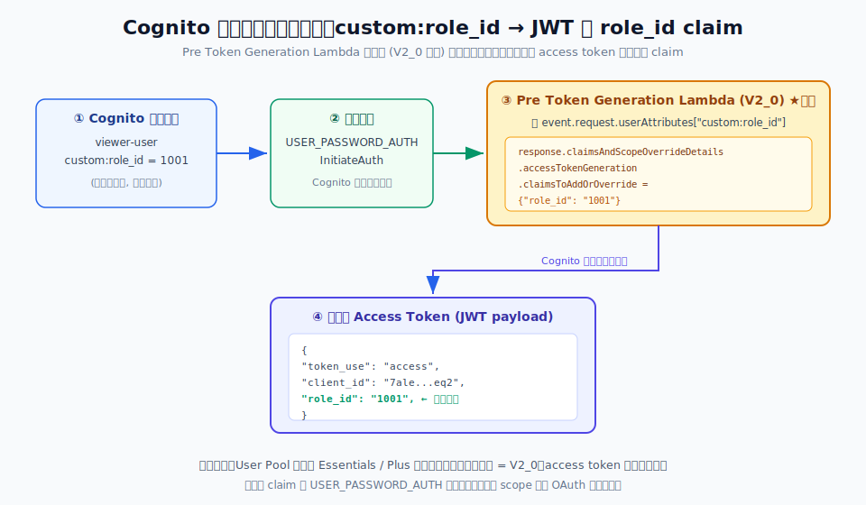
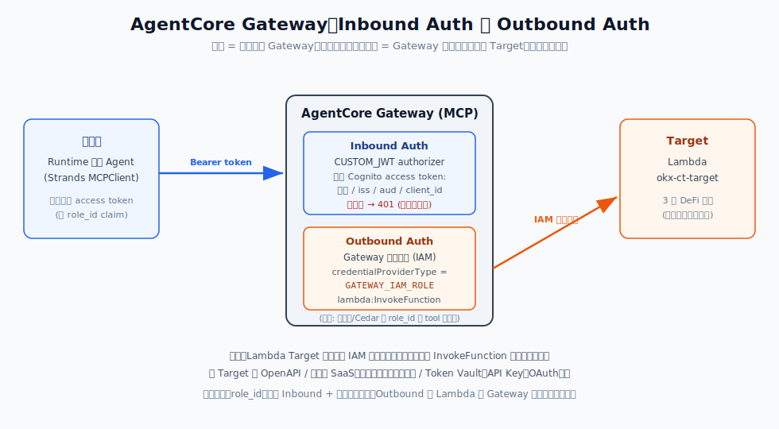
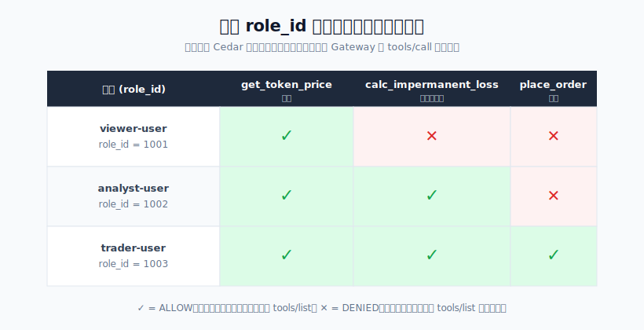

# Cognito 实战教学：什么是 Cognito、怎么用、如何往 JWT 注入自定义字段

> 本文是 `cognito-test` 分支的**教学主文档**，用一个真实部署、真实实测的端到端案例，带你搞懂：
> 1. **Cognito 是什么**、它在鉴权链路里扮演什么角色；
> 2. **怎么用 Cognito** 生成 JWT；
> 3. **如何往 JWT 注入自定义字段**（本例：`role_id`）——这是重点；
> 4. 用注入的 `role_id` 在 **AgentCore Gateway** 做 tool 级授权（拦截器 + Cedar 两种）；
> 5. AgentCore Runtime 里的 **MCP client 需要怎样改造才能带 Header**（用户重点）；
> 6. Gateway 的 **Inbound Auth vs Outbound Auth**（用户重点）。
>
> 全部资源部署在 **us-east-1**，基于 **Strands SDK + Amazon Cognito + AgentCore Gateway（Lambda Target）**。

---

## 目录

- [0. 部署架构总览](#0-部署架构总览)
- [1. Cognito 是什么](#1-cognito-是什么)
- [2. 三种令牌：ID / Access / Refresh Token](#2-三种令牌id--access--refresh-token)
- [3. 【重点】如何往 JWT 注入自定义字段 role_id](#3-重点如何往-jwt-注入自定义字段-role_id)
  - [3.1 自定义属性 vs 自定义 claim](#31-自定义属性-vs-自定义-claim)
  - [3.2 Pre Token Generation Lambda 触发器](#32-pre-token-generation-lambda-触发器)
  - [3.3 关键前提：Essentials 功能层](#33-关键前提essentials-功能层)
  - [3.4 实测：role_id 确实进了 access token](#34-实测role_id-确实进了-access-token)
- [4. 【重点】Runtime 里的 MCP client 要怎么改才能带 Header](#4-重点runtime-里的-mcp-client-要怎么改才能带-header)
- [5. 【重点】Gateway 的 Inbound Auth 与 Outbound Auth](#5-重点gateway-的-inbound-auth-与-outbound-auth)
- [6. 基于 role_id 的工具授权（拦截器 + Cedar）](#6-基于-role_id-的工具授权拦截器--cedar)
- [7. 正反用例实测结果](#7-正反用例实测结果)
- [8. 复现步骤](#8-复现步骤)
- [9. 资源清理](#9-资源清理)

---

## 0. 部署架构总览

在深入每个知识点之前，先用一张图看清整套 Demo 的部署架构与数据流。它把后文的 §1–§7 串成一条完整链路：



**三段式数据流（对应后文各节）**：

1. **① 身份签发 · Amazon Cognito**（对应 [§1](#1-cognito-是什么)–[§3](#3-重点如何往-jwt-注入自定义字段-role_id)）：用户目录里的 `custom:role_id` 属性 → Pre-Token-Gen Lambda（V2_0）在签发前读取并注入成 `role_id` claim → 写进 access token。这是「往 JWT 注入自定义字段」的核心。
2. **② 调用 Agent · AgentCore Runtime**（对应 [§4](#4-重点runtime-里的-mcp-client-要怎么改才能带-header)）：用户带 JWT 调 Runtime，Runtime 入站校验 JWT 并经 `requestHeaderAllowlist` 放行 `Authorization`；Agent 里的 **MCPClient 必须显式把 token 注入**发往 Gateway 的 HTTP 头——这是用户最关心的「MCP client 要不要改造」的答案（答案：要）。
3. **③ 工具授权 · AgentCore Gateway**（对应 [§5](#5-重点gateway-的-inbound-auth-与-outbound-auth)–[§7](#7-正反用例实测结果)）：两个 Gateway 各配 **Inbound Auth**（CUSTOM_JWT，无/伪造 token → 401）+ 工具级授权（A 用拦截器代码、B 用 Cedar 声明式策略），按 `role_id` 决定能调哪些工具；**Outbound Auth** 用 Gateway 自己的 IAM 角色去调 Target Lambda。两种授权机制在同一批 token 下结果完全一致。

> 图中资源名（`okx-ct-*`、`<POOL_ID>` 等）为本教学示例的部署形态，账号/资源 ID 已脱敏；真实值仅在本机的部署产物 `cognito_ids_ct.env` 中，不入库。

---

## 1. Cognito 是什么

**Amazon Cognito** 是 AWS 的**用户身份与访问管理（CIAM）**服务。你可以把它理解成一个"托管的用户中心"，帮你解决三件事：

| 能力 | 说明 | 本例用到 |
|------|------|:---:|
| **User Pool（用户池）** | 存用户、管密码、做认证，签发标准 JWT 令牌 | ✅ |
| **App Client（应用客户端）** | 你的应用向 Cognito 认证的入口，定义允许的认证流程 | ✅ |
| **Identity Pool（身份池）** | 把用户身份换成临时 AWS 凭证（访问 S3/DynamoDB 等） | ❌（本例不需要） |

本例只用 **User Pool + App Client**：用户登录 → Cognito 校验密码 → 签发一个 **JWT access token**。这个 token 后续被一路带到 AgentCore Gateway，用来决定"这个用户能调用哪些工具"。

**为什么鉴权场景爱用 Cognito？** 因为它签发的是标准 **OIDC / OAuth 2.0 JWT**，带一个公开的 `discoveryUrl`（`.well-known/openid-configuration`），任何下游服务（这里是 AgentCore Runtime 和 Gateway）都能用它**验签、验 issuer、验 audience**，无需自己造轮子。

---

## 2. 三种令牌：ID / Access / Refresh Token

Cognito User Pool 认证成功后返回三个令牌，别搞混：

| 令牌 | 用途 | 典型内容 | 本例角色 |
|------|------|---------|---------|
| **ID Token** | 证明"你是谁"（身份） | `name`、`email`、`cognito:groups`… | 对照演示 |
| **Access Token** | 授权"你能访问什么"（**授权令牌**） | `scope`、`client_id`、`username`… | **主角** |
| **Refresh Token** | 换取新的 ID/Access token | 不透明 | 不涉及 |

> **为什么把 `role_id` 注入 Access Token 而不是 ID Token？**
> 因为按 OAuth 语义，**access token 才是"授权令牌"**——它专门用于访问受保护资源（这里 = 调用 Gateway 上的工具）。把授权信号（`role_id`）放在 access token 是标准做法，也和 AgentCore Gateway 的 `CUSTOM_JWT` 入站授权器直接对齐。
> （本例的触发器**同时**把 `role_id` 写进了 ID token，方便你解码对照，但真正用于授权的是 access token。）

---

## 3. 【重点】如何往 JWT 注入自定义字段 role_id

这是本文的核心。目标：让每个用户的 access token 里带一个自定义字段 `role_id`（`1001`/`1002`/`1003`），后续用它做工具授权。



### 3.1 自定义属性 vs 自定义 claim

这是最容易混淆的两个概念，务必分清：

| | 自定义**属性**（custom attribute） | 自定义 **claim** |
|---|---|---|
| 在哪 | 存在 **Cognito 用户目录**里（用户的一条属性） | 出现在**签发的 JWT** 里 |
| 命名 | 强制带 `custom:` 前缀，如 `custom:role_id` | 你自己定，如 `role_id` |
| 谁写入 | 建用户时写 / 用户自己改 | 由 **Pre Token Generation Lambda** 在签发前注入 |
| 会自动进 JWT 吗 | **不会自动进 access token**（默认只在特定条件进 ID token） | —— |

**本例的映射链**：`custom:role_id`（属性，存目录） → 触发器读取 → 注入成 `role_id`（claim，进 access token）。

建用户池时声明这个自定义属性：

```bash
aws cognito-idp create-user-pool \
  --pool-name okx-ct-pool \
  --user-pool-tier ESSENTIALS \
  --schema Name=role_id,AttributeDataType=String,Mutable=true,Required=false \
  --lambda-config "PreTokenGenerationConfig={LambdaArn=<PRETOKEN_ARN>,LambdaVersion=V2_0}"
```

> 注意：`--schema Name=role_id` 声明后，属性的真实名字是 **`custom:role_id`**（Cognito 自动加前缀）。建用户时用 `Name=custom:role_id,Value=1001`。

### 3.2 Pre Token Generation Lambda 触发器

Cognito 允许你挂一个 Lambda，在**签发令牌之前**被调用，从而定制 claim。关键是选对**触发器事件版本**：

| 事件版本 | 能定制什么 | 需要的功能层 |
|---------|-----------|-------------|
| `V1_0`（Basic） | **只能定制 ID token** | 任意（含 Lite） |
| **`V2_0`** | 定制 **access token**（用户身份） | **Essentials / Plus** |
| `V3_0` | 定制 access token（含 M2M 机器身份） | Essentials / Plus |

本例要往 access token 注入，所以用 **`V2_0`**。触发器 Lambda 的核心代码（见 `pretoken_lambda.py`）：

```python
def lambda_handler(event, context):
    attrs = (event.get("request") or {}).get("userAttributes") or {}
    role_id = attrs.get("custom:role_id")           # ← 读用户目录里的自定义属性

    add_claims = {"role_id": str(role_id)} if role_id is not None else {}

    event["response"] = {
        "claimsAndScopeOverrideDetails": {
            "accessTokenGeneration": {               # ← V2 才有的字段: 定制 access token
                "claimsToAddOrOverride": add_claims
            },
            "idTokenGeneration": {                   # (同时也写进 id token, 便于对照)
                "claimsToAddOrOverride": add_claims
            }
        }
    }
    return event
```

别忘了给 Cognito 授予调用该 Lambda 的权限：

```bash
aws lambda add-permission --function-name okx-ct-pretoken \
  --statement-id cognito-invoke --action lambda:InvokeFunction \
  --principal cognito-idp.amazonaws.com \
  --source-arn "arn:aws:cognito-idp:<REGION>:<ACCOUNT>:userpool/<POOL_ID>"
```

### 3.3 关键前提：Essentials 功能层

**这是最容易踩的坑**：往 access token 注入自定义 claim（V2/V3 触发器）要求 User Pool 是 **Essentials 或 Plus 功能层**。
- Lite 层：只能定制 ID token（除非额外开启 ASF 高级安全功能，按 MAU 计费）。
- 2025-01 起，Essentials/Plus 默认包含 access token 定制能力，**无需**单独开 ASF。

所以本例建池时显式指定 `--user-pool-tier ESSENTIALS`。功能层按 MAU（月活用户）计费，demo 用户极少，成本可忽略，且用后即删。

> 事实依据：AWS 文档 *Pre token generation Lambda trigger* 与 *Essentials plan features*，AWS 安全博客 *How to customize access tokens in Amazon Cognito user pools*（2025-01-28 更新）。

### 3.4 实测：role_id 确实进了 access token

用 `USER_PASSWORD_AUTH` 登录，解码 access token 的 payload：

```
viewer-user    token_use=access  role_id='1001'  client_id=<APP_CLIENT_ID>
analyst-user   token_use=access  role_id='1002'  client_id=<APP_CLIENT_ID>
trader-user    token_use=access  role_id='1003'  client_id=<APP_CLIENT_ID>
```

三个用户的 access token（`token_use=access`）都带上了正确的 `role_id`。**注入成功。**

> **一个重要细节**：自定义 **claim**（`claimsToAddOrOverride`）经 `USER_PASSWORD_AUTH`/`InitiateAuth` 也能带出；而自定义 **scope**（`scopesToAdd`）只有走 OAuth 端点（hosted-UI）才会返回。本例用 claim，所以不需要搭 hosted-UI，直接 `InitiateAuth` 就能拿到带 `role_id` 的 token。

---

## 4. 【重点】Runtime 里的 MCP client 要怎么改才能带 Header

**用户的核心疑问**：在 AgentCore Runtime 里，Agent 用 MCP client 去调 Gateway 时，**需不需要改造 MCP client 才能把 Header（尤其是 `Authorization`）带上？**

**答案：需要，而且必须显式配置。** MCP client 默认**不会**自动把"入站用户的 token"透传给下游 Gateway——你得手动把 `Authorization` 头塞进 MCP 的传输层。

本例用 Strands 的 `MCPClient` + `streamablehttp_client(headers=...)` 演示这个改造点（见 `agent.py`）：

```python
from strands.tools.mcp import MCPClient
from mcp.client.streamable_http import streamablehttp_client

def _make_mcp_client(user_token):
    def _transport():
        return streamablehttp_client(
            GATEWAY_URL,
            headers={"Authorization": f"Bearer {user_token}"},   # ← 关键: 显式注入用户 token
        )
    return MCPClient(_transport)
```

而 `user_token` 来自哪里？来自**入站请求头**——但 Runtime 默认也**不会**把 `Authorization` 头传进容器，必须在 `CreateAgentRuntime` 时把它加入白名单：

```json
{ "requestHeaderAllowlist": ["Authorization"] }
```

之后 Agent 才能读到：

```python
auth = context.request_headers.get("Authorization")   # 需先 allowlist
token = auth[len("Bearer "):]
```

**两处缺一不可**：
1. Runtime 侧 `requestHeaderAllowlist` 放行 `Authorization` → Agent 才拿得到用户 token；
2. MCP client 侧 `streamablehttp_client(headers={"Authorization": ...})` → token 才带得到 Gateway。

漏掉第 2 步的后果：Gateway 入站 `CUSTOM_JWT` 授权器收不到 token，直接 **401**（实测："Missing Bearer token"）。

> **为什么透传用户原始 token，而不是让 Agent 用自己的服务身份另铸一个？**
> 因为一旦 Agent 用自己身份（M2M）铸新 token，用户的 `role_id` 就在这一跳丢失了，Gateway 侧的"按用户授权"会失效。透传原始 token 的前提是 Runtime 与 Gateway 信任**同一个 Cognito Pool + App Client**，这样同一个 token 两端都能过。

---

## 5. 【重点】Gateway 的 Inbound Auth 与 Outbound Auth



AgentCore Gateway 的认证分两个方向，别混为一谈：

### Inbound Auth（入站）——"谁能调用 Gateway"
- 机制：`CUSTOM_JWT` 授权器。建 Gateway 时配 `authorizer-configuration`：
  ```json
  {"customJWTAuthorizer": {"discoveryUrl": "<COGNITO_DISCOVERY_URL>", "allowedClients": ["<APP_CLIENT_ID>"]}}
  ```
- 作用：校验调用方带来的 Cognito **access token**——验签名、验 `issuer`、验 `client_id`。
- 不合法（无 token / 伪造）→ 直接 **401**，**在拦截器 / Cedar 之前**就拦掉。这是第一道防线。

### Outbound Auth（出站）——"Gateway 用什么身份去调 Target"
- 本例 Target 是 **Lambda**，出站用 **Gateway 执行角色（IAM）**：
  ```json
  [{"credentialProviderType": "GATEWAY_IAM_ROLE"}]
  ```
  该角色只被授予 `lambda:InvokeFunction`，且收敛到本 Demo 的具体函数（最小权限）。
- 如果 Target 是 **OpenAPI / 第三方 SaaS**（Slack、Google 等），出站则改用**凭证提供者 / Token Vault**（API Key、OAuth 2.0），这才是 AgentCore Identity "出站认证"的用武之地。

**一句话区分**：
- **Inbound** 用的是**调用方（用户）的身份** → 决定"能不能进 + 能调哪些工具"；
- **Outbound** 用的是 **Gateway 自己的服务身份**（IAM 角色）→ 决定"Gateway 怎么访问后端 Lambda"。
- 用户的 `role_id` 只参与 Inbound + 授权阶段，不参与 Outbound。

---

## 6. 基于 role_id 的工具授权（拦截器 + Cedar）

Gateway 上挂 1 个 Lambda Target `defi`，暴露 3 个工具。我们实现了**两种** Gateway 侧 tool 级授权，都按 **`role_id`** 判定，结果完全一致。

**role_id → 工具映射**：

| role_id | 语义 | 允许的工具 |
|---------|------|-----------|
| `1001` | viewer | `get_token_price` |
| `1002` | analyst | `get_token_price` + `calc_impermanent_loss` |
| `1003` | trader | 全部 3 个 |

### 方案 A：拦截器 Interceptor
`interceptor_lambda.py` 同时处理 REQUEST + RESPONSE 两个拦截点：
- **REQUEST**：解出 `role_id`，对 `tools/call` 判断该 role 是否有权限，无权限则返回 `transformedGatewayResponse`（JSON-RPC error，code `-32001`）短路，Gateway 不调 target = 拒绝。
- **RESPONSE**：对 `tools/list` 结果按 `role_id` 过滤（同时过滤 `result.tools` 和 `result.structuredContent.tools`，堵住语义搜索路径），无权限工具对该用户不可见。
- **fail-closed**：无 token / 无 `role_id` / 异常 → 一律拒绝。

```python
ROLE_TOOLS = {
    "1001": {"get_token_price"},
    "1002": {"get_token_price", "calc_impermanent_loss"},
    "1003": {"get_token_price", "calc_impermanent_loss", "place_order"},
}
```

### 方案 B：非拦截器 Cedar Policy Engine
不写授权代码，改用声明式 Cedar 策略（`policies/*.cedar`），默认拒绝、可审计：

```cedar
// place_order: 仅 role_id 1003
permit(
  principal is AgentCore::OAuthUser,
  action == AgentCore::Action::"defi___place_order",
  resource == AgentCore::Gateway::"<GATEWAY_ARN>"
) when {
  principal.hasTag("role_id") && principal.getTag("role_id") == "1003"
};
```

> **一个和 Task 2（groups）不同的好处**：`role_id` 是**单值字符串** claim，落到 Cedar tag 也是字符串，可以直接用 `== "1002"` 精确匹配；而 `cognito:groups` 是多值的，之前只能用 `like "*trader*"` 变通。**单值自定义 claim 让 Cedar 策略更干净。**
>
> **踩坑记录（本例实测经验，非 AWS 明文规定）**：Cedar 策略最好在 **Gateway target（工具 action）注册完成之后**再创建。本例先建策略时，策略引擎的 schema 里还没有 `defi___place_order` 这个 action，报 `unrecognized action` 而 `CREATE_FAILED`；在 target 就绪后删掉重建即 `ACTIVE`。这与 Cedar / Verified Permissions 的严格 schema 校验语义一致，但 AWS 文档未正面写明该排序要求，故记为实测结论。

---

## 7. 正反用例实测结果



**两种机制的权限矩阵完全一致**（数据见 `matrix_ct_interceptor.json` / `matrix_ct_cedar.json`）：

| 用户 (role_id) | get_token_price | calc_impermanent_loss | place_order |
|------|:---:|:---:|:---:|
| viewer-user (1001) | ✅ ALLOW | ✕ DENIED | ✕ DENIED |
| analyst-user (1002) | ✅ ALLOW | ✅ ALLOW | ✕ DENIED |
| trader-user (1003) | ✅ ALLOW | ✅ ALLOW | ✅ ALLOW |

- **正向**：有权限 → 返回真实结果（`get_token_price(BTC)` → `$64,250`）。
- **反向**：无权限 → 被拒（拦截器 `-32001`、Cedar `-32002`），且 `tools/list` 里看不到该工具。
- **fail-closed**：无 token → 401 "Missing Bearer token"；伪造 token → 401 "Invalid Bearer token"（Inbound 授权器，拦截器之前）。

**端到端（经 Runtime + Strands Agent，用 MCPClient 透传）实测**（数据见 `runtime_e2e_ct_result.json`）：

| 用户 | 请求 | Agent 可见工具 | 实际调用 | 结果 |
|------|------|---------------|---------|------|
| viewer (1001) | 查 ETH 价 + 下单 | 只有 price | `get_token_price` | ✅ 查价 $3,120.5；**拒绝下单**（无权限工具不可见） |
| analyst (1002) | 算 IL(r=2) + 卖单 | price + IL | `calc_impermanent_loss` | ✅ IL -5.72%；**拒绝下单** |
| trader (1003) | 查 BTC 价 + 下单 | 全部 3 个 | `get_token_price`, `place_order` | ✅ 查价 $64,250 + mock 下单成功 |

**同一个 Agent、同一段代码，只因用户 `role_id` 不同，可见并可用的工具集合就不同。**

> 证据边界：E2E 表证明"Gateway 按 role_id 过滤了 tools/list + Agent 据此行为"；"越权调用被拒"的硬证据在上面的**权限矩阵**（直连 Gateway 对 tools/call 逐一实测，规避 LLM 非确定性）。两者合起来是完整闭环。

---

## 8. 复现步骤

```bash
export AWS_REGION=us-east-1
./deploy_ct.sh                     # 建 Essentials 池 + pretoken Lambda + 3 用户 + 两个 Gateway + Runtime
set -a; source cognito_ids_ct.env; set +a

python interceptor_unit_test.py                    # 本地单测 (免部署) 23/23
python mcp_matrix_test_ct.py "$GW_A_URL" interceptor  # 拦截器 role_id 矩阵
python mcp_matrix_test_ct.py "$GW_B_URL" cedar        # Cedar role_id 矩阵
python runtime_e2e_test_ct.py run$(date +%s)          # 三用户端到端

./cleanup_ct.sh                    # 清理全部资源
```

---

## 9. 资源清理

`./cleanup_ct.sh` 一键删除（顺序避免残留计费）：Runtime → 两个 Gateway 的 target/Gateway/Policy Engine → 3 个 Lambda + 日志组 → Cognito（用户/App Client/User Pool）→ ECR → IAM 角色。

> `place_order` 是**纯 mock**，不触达任何真实交易系统，零副作用。

---

*本文全部结论来自 us-east-1 的真实部署与实测；关键数据可在 `matrix_ct_*.json` / `runtime_e2e_ct_result.json` 复核。*
