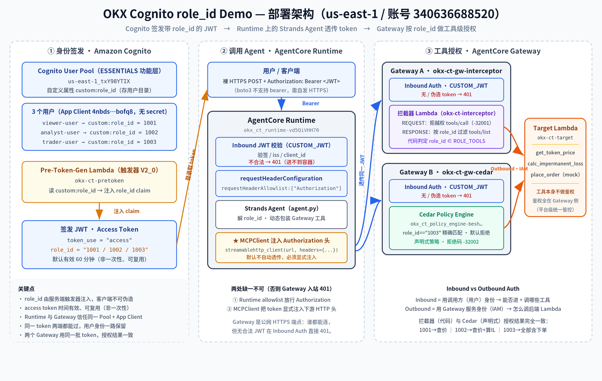

# Cognito 自定义 role_id — 人工 Live Demo 手册（可直接复制执行）

> 本手册配合 [COGNITO_GUIDE.md](COGNITO_GUIDE.md) 使用：**GUIDE 讲原理，本手册给"直接能跑"的命令**。
> 下面所有命令的参数（Account ID、Pool ID、Client ID、Gateway URL、Runtime ARN 等）**已填好本次部署的真实值**，
> 在这台已配好 AWS 凭证的机器上（`/home/ec2-user/agentcore/identity`），**逐条复制粘贴即可执行**。
>
> ⚠️ 唯一不填死的是 **JWT access token**：它是 bearer 凭证、默认 60 分钟过期，所以每处都用一行命令**现取现用**（见 Step 0 的 `get_token` 函数）。
>
> **演示区域**：`us-east-1` ｜ **账号**：`340636688520`

---

## 部署架构总览

下图是本次测试环境的完整部署架构——从 Cognito 签发带 `role_id` 的 JWT，到 Runtime 上的 Strands Agent 透传 token，再到两个 Gateway 按 `role_id` 做工具级授权。图中标注的都是本次部署的**真实资源名**（与下方资源清单一致）。



**三段式数据流（对应下面 Step 的演示顺序）**：

1. **① 身份签发（Cognito）** — 用户目录里的 `custom:role_id` → Pre-Token-Gen Lambda（V2）注入成 `role_id` claim → 签发到 access token（对应 Step 1–4）。
2. **② 调用 Agent（Runtime）** — 用户带 JWT 调 Runtime；Runtime 入站校验 JWT，`requestHeaderAllowlist` 放行 `Authorization`，Agent 里的 **MCPClient 把 token 显式注入**发往 Gateway 的 HTTP 头（对应 Step 8）。
3. **③ 工具授权（Gateway）** — 两个 Gateway 各配 Inbound Auth（JWT 校验，无/伪造 token → 401）+ 工具级授权（A 用拦截器代码、B 用 Cedar 声明式策略），按 `role_id` 决定能调哪些工具；出站用 Gateway 自己的 IAM 角色调 Target Lambda（对应 Step 5–7）。

---

## 本次部署的资源清单（速查）

| 资源 | 值 |
|------|----|
| Cognito User Pool | `us-east-1_txY98YTIX`（Essentials 功能层） |
| App Client ID | `4nbdsnv0n42q3pq1n4td5bofq8`（无 secret，USER_PASSWORD_AUTH） |
| Pre-Token-Gen Lambda | `arn:aws:lambda:us-east-1:340636688520:function:okx-ct-pretoken`（V2_0） |
| Target Lambda（3 工具） | `arn:aws:lambda:us-east-1:340636688520:function:okx-ct-target` |
| 拦截器 Lambda | `arn:aws:lambda:us-east-1:340636688520:function:okx-ct-interceptor` |
| **Gateway A（拦截器）** | `https://okx-ct-gw-interceptor-pyvooj4iyq.gateway.bedrock-agentcore.us-east-1.amazonaws.com/mcp` |
| **Gateway B（Cedar）** | `https://okx-ct-gw-cedar-4vylpdis43.gateway.bedrock-agentcore.us-east-1.amazonaws.com/mcp` |
| Cedar Policy Engine | `okx_ct_policy_engine-besh25vmfc` |
| **Runtime**（指向 Gateway A） | `arn:aws:bedrock-agentcore:us-east-1:340636688520:runtime/okx_ct_runtime-vd5QiVHH70` |
| 3 个用户 | `viewer-user`(role_id=1001) / `analyst-user`(1002) / `trader-user`(1003)，密码 `OkxDemo#2026` |

**权限矩阵（演示目标）**：

| 用户 (role_id) | get_token_price | calc_impermanent_loss | place_order |
|------|:---:|:---:|:---:|
| viewer-user (1001) | ✅ | ❌ | ❌ |
| analyst-user (1002) | ✅ | ✅ | ❌ |
| trader-user (1003) | ✅ | ✅ | ✅ |

---

## Step 0 — 准备工作（每次开新终端先跑这一段）

**意图**：进入工作目录，注入环境变量，并定义一个"按用户名取 access token"的函数 `get_token`，供后面所有步骤复用。

```bash
cd /home/ec2-user/agentcore/identity
export AWS_REGION=us-east-1
export ACCOUNT=340636688520
export POOL_ID=us-east-1_txY98YTIX
export CLIENT_ID=4nbdsnv0n42q3pq1n4td5bofq8
export GW_A_URL="https://okx-ct-gw-interceptor-pyvooj4iyq.gateway.bedrock-agentcore.us-east-1.amazonaws.com/mcp"
export GW_B_URL="https://okx-ct-gw-cedar-4vylpdis43.gateway.bedrock-agentcore.us-east-1.amazonaws.com/mcp"
export RT_ARN="arn:aws:bedrock-agentcore:us-east-1:340636688520:runtime/okx_ct_runtime-vd5QiVHH70"
export PE_ID=okx_ct_policy_engine-besh25vmfc
export DEMO_PASSWORD='OkxDemo#2026'

# 现取某用户的 access token（60 分钟有效，每次调用都新取，不会过期）
get_token () {
  aws cognito-idp initiate-auth --region "$AWS_REGION" \
    --auth-flow USER_PASSWORD_AUTH --client-id "$CLIENT_ID" \
    --auth-parameters USERNAME="$1",PASSWORD="$DEMO_PASSWORD" \
    --query 'AuthenticationResult.AccessToken' --output text
}
echo "✅ 环境就绪。已定义 get_token <username>"
```

---

## Step 1 — "Cognito 是什么"：查看这个 User Pool

**场景意图**：向客户展示这不是空谈——真有一个 Cognito 用户池，而且它是 **Essentials 功能层**（这是能往 access token 注入自定义字段的前提）。

```bash
aws cognito-idp describe-user-pool --region "$AWS_REGION" --user-pool-id "$POOL_ID" \
  --query 'UserPool.{Name:Name, Tier:UserPoolTier, PreTokenTrigger:LambdaConfig.PreTokenGenerationConfig, CustomAttr:SchemaAttributes[?Name==`custom:role_id`].[Name,AttributeDataType]}' \
  --output json
```

**期望看到**：`Tier: "ESSENTIALS"`；`PreTokenTrigger` 指向 `okx-ct-pretoken` 且 `LambdaVersion: "V2_0"`；`CustomAttr` 里有 `custom:role_id`。
**讲解点**：功能层 = Essentials 才允许 V2 触发器定制 access token；`custom:role_id` 是我们在用户目录里自定义的属性。

---

## Step 2 — 查看用户，看它身上的 custom:role_id

**场景意图**：展示"每个 C 端用户在目录里带一个 role_id 属性"。这就是权限的源头。

```bash
for u in viewer-user analyst-user trader-user; do
  echo "--- $u ---"
  aws cognito-idp admin-get-user --region "$AWS_REGION" --user-pool-id "$POOL_ID" --username "$u" \
    --query 'UserAttributes[?Name==`custom:role_id`]' --output text
done
```

**期望看到**：viewer-user → `1001`，analyst-user → `1002`，trader-user → `1003`。
**讲解点**：此刻 role_id 只是"目录里的一条属性"，还没进 JWT。下一步由触发器把它注入 token。

---

## Step 3 — 【核心】登录并解码 access token，看 role_id 已注入

**场景意图**：**这是整个 demo 最有说服力的一步**。用户登录拿到 access token，解码后看到里面多了一个 `role_id` claim——它是 Pre-Token-Gen Lambda 在签发前动态注入的。

```bash
for u in viewer-user analyst-user trader-user; do
  TOKEN=$(get_token "$u")
  echo "=== $u 的 access token payload ==="
  echo "$TOKEN" | cut -d. -f2 | tr '_-' '/+' | base64 -d 2>/dev/null | python3.12 -m json.tool 2>/dev/null | grep -E '"(token_use|client_id|username|role_id|scope)"'
done
```

**期望看到**：每个用户的 payload 里 `"token_use": "access"` 且 `"role_id"` 分别是 `"1001"/"1002"/"1003"`。
**讲解点**：`role_id` 并非用户登录时传入，而是**服务端触发器注入**的——客户端无法伪造，这是可信的授权信号。

> 想看完整 payload（去掉末尾 grep 即可）：
> ```bash
> get_token trader-user | cut -d. -f2 | tr '_-' '/+' | base64 -d 2>/dev/null | python3.12 -m json.tool
> ```

---

## Step 4 — 看一眼"是谁注入的"：Pre-Token-Gen Lambda 代码

**场景意图**：把上一步的"魔法"落到实处——就是这段 20 行的 Lambda 做的。

```bash
sed -n '/^def lambda_handler/,/return event/p' pretoken_lambda.py
```

**讲解点**：读 `event.request.userAttributes["custom:role_id"]` → 写进 `response.claimsAndScopeOverrideDetails.accessTokenGeneration.claimsToAddOrOverride`。`accessTokenGeneration` 这个字段只有 V2_0 事件才有（对应 GUIDE §3.2）。

---

## Step 5 — 【反向】Inbound Auth：无 token / 伪造 token 直接被 Gateway 拒（401）

**场景意图**：演示 Gateway 的**入站认证（Inbound Auth）**是第一道防线——在任何工具授权之前，先校验 JWT。这是 fail-closed 的反向用例。

```bash
echo "### 5a. 不带 token 调 Gateway A ###"
curl -s -o /dev/null -w "HTTP %{http_code}\n" -X POST "$GW_A_URL" \
  -H "Content-Type: application/json" \
  -d '{"jsonrpc":"2.0","id":1,"method":"tools/list","params":{}}'

echo "### 5b. 带伪造 token 调 Gateway A ###"
curl -s -X POST "$GW_A_URL" \
  -H "Authorization: Bearer not.a.real.jwt" -H "Content-Type: application/json" \
  -d '{"jsonrpc":"2.0","id":1,"method":"tools/list","params":{}}'
echo ""

echo "### 5c. 同样两发打 Cedar Gateway B ###"
curl -s -o /dev/null -w "no-token  HTTP %{http_code}\n" -X POST "$GW_B_URL" \
  -H "Content-Type: application/json" -d '{"jsonrpc":"2.0","id":1,"method":"tools/list","params":{}}'
curl -s -X POST "$GW_B_URL" -H "Authorization: Bearer not.a.real.jwt" -H "Content-Type: application/json" \
  -d '{"jsonrpc":"2.0","id":1,"method":"tools/list","params":{}}'; echo ""
```

**期望看到**：`HTTP 401`；body 为 `"Missing Bearer token"`（无 token）/ `"Invalid Bearer token"`（伪造）。
**讲解点**：这一步发生在拦截器 / Cedar **之前**——入站授权器（CUSTOM_JWT）先校验签名/issuer/client_id，不合法根本进不去（对应 GUIDE §5 Inbound Auth）。

---

## Step 6 — 【拦截器方案】按 role_id 做 tools/list 过滤 + tools/call 授权

**场景意图**：核心正反用例。用**真实用户 token 直连 Gateway A（拦截器）**，逐一试三个工具，看权限如何随 role_id 变化。直连（而非经 LLM）是为了得到确定性的硬证据。

### 6.1 tools/list — 每个用户"看得见"哪些工具（RESPONSE 拦截器过滤）

```bash
for u in viewer-user analyst-user trader-user; do
  TOKEN=$(get_token "$u")
  echo -n "[$u] 可见工具: "
  curl -s -X POST "$GW_A_URL" -H "Authorization: Bearer $TOKEN" -H "Content-Type: application/json" \
    -d '{"jsonrpc":"2.0","id":1,"method":"tools/list","params":{}}' \
    | python3.12 -c "import sys,json; print([t['name'].split('___')[-1] for t in json.load(sys.stdin).get('result',{}).get('tools',[])])"
done
```

**期望**：viewer→`['get_token_price']`；analyst→`['get_token_price','calc_impermanent_loss']`；trader→全部 3 个。

### 6.2 【正向】trader（1003）调 place_order → 成功

**场景**：交易员有下单权限。

```bash
TOKEN=$(get_token trader-user)
curl -s -X POST "$GW_A_URL" -H "Authorization: Bearer $TOKEN" -H "Content-Type: application/json" \
  -d '{"jsonrpc":"2.0","id":1,"method":"tools/call","params":{"name":"defi___place_order","arguments":{"symbol":"BTC","side":"buy","qty":0.01}}}' \
  | python3.12 -m json.tool
```

**期望**：返回 `MOCK_ACCEPTED` 的下单结果（正常业务响应）。

### 6.3 【反向】viewer（1001）调 place_order → 被拒

**场景**：只读用户越权下单，必须被挡。

```bash
TOKEN=$(get_token viewer-user)
curl -s -X POST "$GW_A_URL" -H "Authorization: Bearer $TOKEN" -H "Content-Type: application/json" \
  -d '{"jsonrpc":"2.0","id":1,"method":"tools/call","params":{"name":"defi___place_order","arguments":{"symbol":"BTC","side":"buy","qty":0.01}}}' \
  | python3.12 -m json.tool
```

**期望**：返回 JSON-RPC `error`，`code: -32001`，message 含 `AUTHZ DENIED: role_id 1001 may not call tool 'place_order'`。
**讲解点**：REQUEST 拦截器解出 role_id=1001，发现无权限，直接短路返回错误，**根本没调到后端 Lambda**（对应 GUIDE §6 方案 A）。

### 6.4 【反向】analyst（1002）调 place_order → 被拒（但 calc_impermanent_loss 可以）

```bash
TOKEN=$(get_token analyst-user)
echo "### analyst 调 place_order (应被拒) ###"
curl -s -X POST "$GW_A_URL" -H "Authorization: Bearer $TOKEN" -H "Content-Type: application/json" \
  -d '{"jsonrpc":"2.0","id":1,"method":"tools/call","params":{"name":"defi___place_order","arguments":{"symbol":"ETH","side":"sell","qty":1}}}' \
  | python3.12 -c "import sys,json; d=json.load(sys.stdin); print('DENIED:', d['error']['message']) if 'error' in d else print('ALLOW', d)"
echo "### analyst 调 calc_impermanent_loss (应成功) ###"
curl -s -X POST "$GW_A_URL" -H "Authorization: Bearer $TOKEN" -H "Content-Type: application/json" \
  -d '{"jsonrpc":"2.0","id":1,"method":"tools/call","params":{"name":"defi___calc_impermanent_loss","arguments":{"price_ratio":2.0}}}' \
  | python3.12 -m json.tool
```

**期望**：place_order → `DENIED`；calc_impermanent_loss → 返回 `impermanent_loss_pct: -5.7191`。

### 6.5 一键出完整权限矩阵（可选，最直观）

```bash
python3.12 mcp_matrix_test_ct.py "$GW_A_URL" interceptor
```

**期望**：打印 3×3 矩阵 + 每用户可见工具，与本手册开头的表一致。

---

## Step 7 — 【Cedar 方案】换个 Gateway，同样按 role_id，结果一致

**场景意图**：证明"授权"不必写代码——Gateway B 用声明式 **Cedar 策略**（默认拒绝、可审计）达到与拦截器**完全相同**的效果。同一批 token，只是换个 Gateway URL。

### 7.1 先看 Cedar 策略长什么样

```bash
for p in $(aws bedrock-agentcore-control list-policies --region "$AWS_REGION" --policy-engine-id "$PE_ID" --query 'policies[].policyId' --output text); do
  echo "--- $p ---"
  aws bedrock-agentcore-control get-policy --region "$AWS_REGION" --policy-engine-id "$PE_ID" --policy-id "$p" \
    --query 'definition.cedar.statement' --output text
done
```

**讲解点**：`principal.getTag("role_id") == "1003"` —— role_id 是单值字符串，Cedar 直接精确匹配（对应 GUIDE §6 方案 B）。

### 7.2 【反向】viewer 调 place_order（Cedar 版）→ 被拒

```bash
TOKEN=$(get_token viewer-user)
curl -s -X POST "$GW_B_URL" -H "Authorization: Bearer $TOKEN" -H "Content-Type: application/json" \
  -d '{"jsonrpc":"2.0","id":1,"method":"tools/call","params":{"name":"defi___place_order","arguments":{"symbol":"BTC","side":"buy","qty":0.01}}}' \
  | python3.12 -m json.tool
```

**期望**：JSON-RPC `error`，`code: -32002`，message 含 `policy enforcement [... denied by default]`。
**讲解点**：Cedar 是**默认拒绝**——没有 permit 命中就拒，与拦截器的显式判断殊途同归。

### 7.3 一键出 Cedar 权限矩阵（应与拦截器完全一致）

```bash
python3.12 mcp_matrix_test_ct.py "$GW_B_URL" cedar
```

**期望**：3×3 矩阵与 Step 6.5 完全一致。

---

## Step 8 — 【端到端】经 AgentCore Runtime + Strands Agent，"同一 Agent 不同身份、不同能力"

**场景意图**：前面是直连 Gateway 的确定性证据；这一步展示**真实产品形态**——用户带 token 调 Runtime 上的 Agent，Agent 把 token 透传给 Gateway，可用工具集随 role_id 自动变化。

### 8.0 【先讲代码】跑之前，先看懂两段关键代码

> demo 时建议先花两分钟把这两段代码讲清楚——它们是"为什么可用工具会随身份变化"的答案。可以现场 `cat` 出来对着讲。

#### （A）Agent 侧：MCP client 的关键改造（`agent.py`）

**这是本 demo 最核心的一处工程改造**：把入站用户的 token，塞进 Runtime 里 MCP client 发往 Gateway 的 HTTP 头。

现场展示这段代码：

```bash
sed -n '/★★★/,/return MCPClient/p' agent.py
```

关键片段（讲解见行内注释）：

```python
from strands.tools.mcp import MCPClient
from mcp.client.streamable_http import streamablehttp_client

def _make_mcp_client(user_token):
    def _transport():
        return streamablehttp_client(
            GATEWAY_URL,
            headers={"Authorization": f"Bearer {user_token}"},   # ← 关键: 把用户 token 注入下游 HTTP 头
        )
    return MCPClient(_transport)          # MCPClient 接收一个"传输层工厂", 每次连接调用它
```

**讲解三句话**：
1. **MCPClient 默认不会自动透传入站 token** —— 你必须自己把 `Authorization` 头塞进传输层，这就是"改造点"。
2. `streamablehttp_client(url, headers={...})` 就是塞头的地方；`MCPClient` 接收的是一个**无参工厂函数**（`_transport`），它在每次建连时被调用，于是每次请求都带上同一个用户 token。
3. 而 `user_token` 从哪来？来自入站请求头——需要 Runtime 先 `requestHeaderAllowlist:["Authorization"]` 放行，Agent 才读得到：

```bash
sed -n '/def invoke/,/role_id = claims/p' agent.py
```

```python
@app.entrypoint
def invoke(payload, context):
    auth = context.request_headers.get("Authorization")   # ← 需 Runtime allowlist 放行才拿得到
    token = auth[len("Bearer "):]
    claims = _decode_claims(token)
    username = claims.get("username")
    role_id = claims.get("role_id")            # ← 就是 Pre-Token-Gen 注入的那个自定义字段
```

**一句话总结**：`Runtime allowlist 放行 Authorization` ＋ `MCP client 显式注入 header` 两处缺一不可；漏掉任一处，Gateway 入站就 401（对应 GUIDE §4）。

#### （B）测试侧：E2E 脚本怎么"扮演不同用户"调 Runtime（`runtime_e2e_test_ct.py`）

这段脚本模拟"三个不同 C 端用户各自带着自己的 token 来调 Agent"。关键是**用裸 HTTPS + Bearer token** 调 Runtime（boto3 不支持 bearer 方式），以及**每次用唯一 session id 规避 warm 缓存**。

现场展示：

```bash
sed -n '/^def invoke/,/http_error/p' runtime_e2e_test_ct.py
```

关键片段：

```python
def invoke(u, prompt, idx):
    tok = token(u)                                    # ← 取该用户的 access token (含其 role_id)
    enc = urllib.parse.quote(RT_ARN, safe="")
    url = f"https://bedrock-agentcore.{REGION}.amazonaws.com/runtimes/{enc}/invocations?qualifier=DEFAULT"
    sid = f"okx-ct-{u}-{RUN}-{idx:024d}"              # ← 唯一 session id, 规避 warm 缓存(踩过的坑)
    body = json.dumps({"prompt": prompt}).encode()
    req = urllib.request.Request(url, data=body, headers={
        "Authorization": f"Bearer {tok}",             # ← 用户 token 放入站头, Runtime 入站校验它
        "Content-Type": "application/json",
        "X-Amzn-Bedrock-AgentCore-Runtime-Session-Id": sid})
    with urllib.request.urlopen(req, timeout=120) as resp:
        return json.loads(resp.read())
```

**讲解三句话**：
1. `token(u)` 给每个用户取**各自的** access token —— 三个用户的 token 里 `role_id` 不同，这是后面能力差异的根源。
2. token 放进 `Authorization: Bearer` 头调 Runtime；**必须用裸 HTTPS**（boto3 SDK 不支持 bearer-token 调用方式）。
3. `X-Amzn-...-Session-Id` 每次用带序号的**唯一值**——因为 Runtime 会复用 warm microVM，固定 session id 会读到旧容器的缓存行为（这是之前踩过的坑）。

返回体里的 `gateway_visible_tools` 和 `tool_trace` 就是证据：同一段 Agent 代码，三个用户拿到的工具集和实际调用完全不同。

### 8.1 一键跑三用户端到端

```bash
python3.12 runtime_e2e_test_ct.py demo$(date +%s)
```

**期望**：
- viewer(1001)：`visible_tools` 只有 price；查 ETH 价成功；**拒绝下单**。
- analyst(1002)：可见 price+IL；算无常损失成功；**拒绝下单**。
- trader(1003)：可见全部；查价 + 下单都成功。

**讲解点**：同一个 Runtime、同一段 Agent 代码，只因调用者 role_id 不同，`gateway_visible_tools` 和实际调用就不同——**权限完全由用户身份驱动**（对应 GUIDE §4 的 MCP client 透传 + §7）。

### 8.2（可选）单独跑某个用户，自定义 prompt

```bash
python3.12 runtime_invoke_test.py trader-user "帮我查一下 BTC 现价，再下单买 0.02 个 BTC"
```
> 注：`runtime_invoke_test.py` 会读环境变量 `RT_ARN` / `CLIENT_ID` / `AWS_REGION`（Step 0 已 export）。

---

## Step 9 —（演示结束后）清理资源，停止计费

**场景意图**：demo 是真实计费资源（Runtime + 2 Gateway + Cognito Essentials + Lambda）。演示完务必清理。

```bash
# 该脚本从 cognito_ids_ct.env 读取标识，一键删除全部资源
./cleanup_ct.sh
```

**清理顺序**：Runtime → 两个 Gateway 的 target/Gateway → Policy Engine + 策略 → 3 个 Lambda + 日志组 → Cognito（用户/Client/Pool）→ ECR → IAM 角色。

> 若需**重新拉起**（换新一批 ARN/ID）：`export AWS_REGION=us-east-1 && ./deploy_ct.sh`，完成后新标识写入 `cognito_ids_ct.env`；届时本手册开头"资源清单"里的具体值会变，用 `cat cognito_ids_ct.env` 取新值替换即可。

---

## 附：一句话串讲（给客户的 demo 主线）

1. Cognito 用户目录里，每个用户带一个 `custom:role_id`（Step 1-2）。
2. 登录时，Pre-Token-Gen Lambda 把它注入 access token 成 `role_id` claim（Step 3-4）——**服务端注入、不可伪造**。
3. 调 Gateway 先过 **Inbound Auth**（JWT 校验），无 token 直接 401（Step 5）。
4. 过了入站后，**拦截器**或 **Cedar** 按 `role_id` 决定能调哪些工具——正向放行、反向拒绝（Step 6-7）。
5. 放到真实产品里（Runtime + Agent），同一 Agent 因用户身份不同而能力不同（Step 8）。

*本手册参数为 us-east-1 / 账号 340636688520 于本次部署的真实值；资源清理后失效，重新部署后用 `cat cognito_ids_ct.env` 取新值。*
