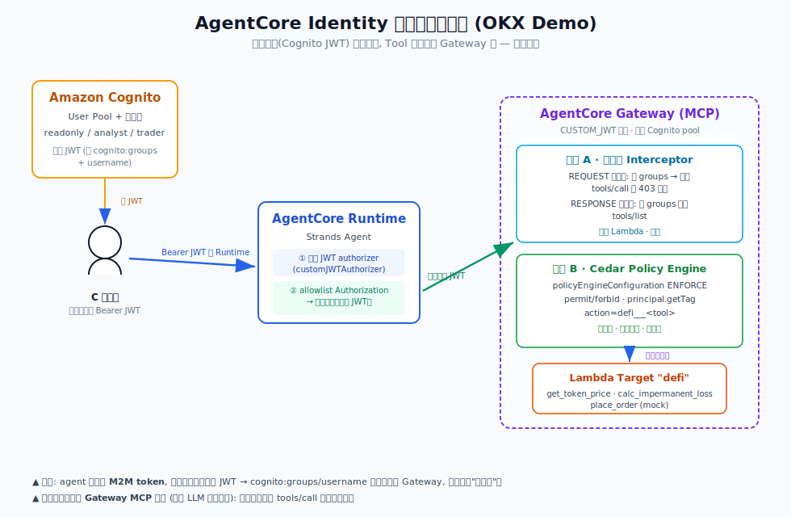
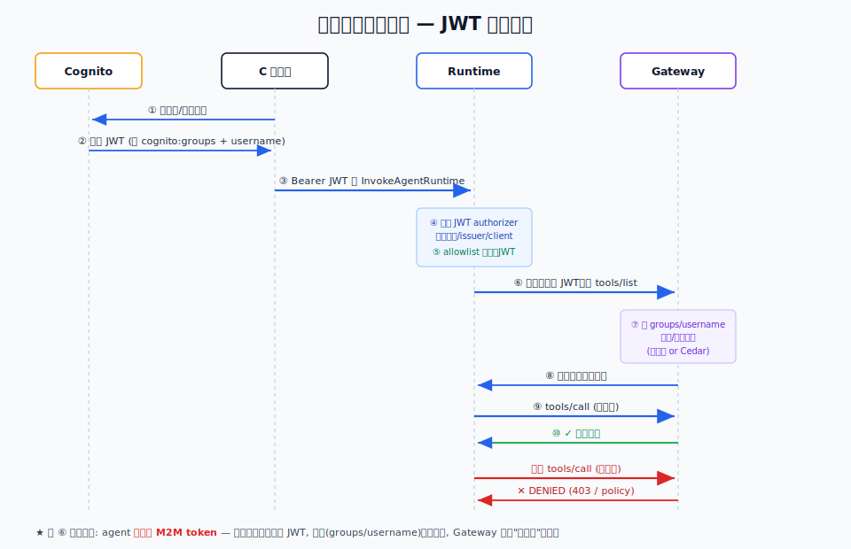
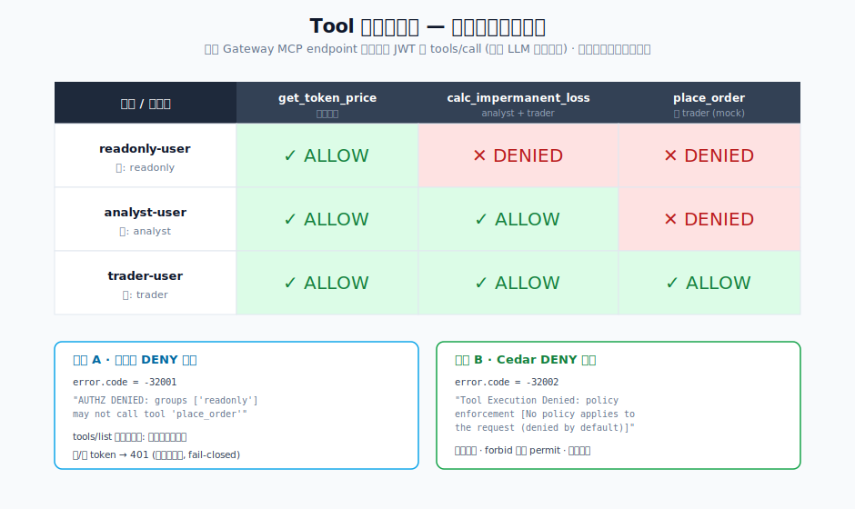

# AgentCore Identity 与鉴权全流程 Demo（OKX）

> 一个**真实部署、真实实测**的端到端示例，回答 OKX 最关心的三个安全问题：
> 1. 用户调用 **AgentCore Runtime** 时如何做身份认证与鉴权？
> 2. 从 **Runtime 调用 AgentCore Gateway** 时如何做认证鉴权？
> 3. **针对每个 Tool** 如何做细粒度鉴权（不同用户不同工具权限）？
>
> 全部资源部署在 **us-east-1**，基于 **Strands SDK + Amazon Cognito + AgentCore Gateway（Lambda Target）**。
> 提供**两种** Gateway 侧 Tool 级鉴权方案：**拦截器（Interceptor）** 与 **非拦截器（Cedar Policy Engine）**，
> 并包含**正向用例（有权限→成功）**与**反向用例（无权限→被拒）**的实测证据。

---

## 目录

- [1. 整体架构](#1-整体架构)
- [2. 三个身份角色与权限矩阵](#2-三个身份角色与权限矩阵)
- [3. 第一问：Runtime 的 User 鉴权](#3-第一问runtime-的-user-鉴权)
- [4. 第二问：Runtime → Gateway 的认证鉴权](#4-第二问runtime--gateway-的认证鉴权)
- [5. 第三问：每个 Tool 的鉴权（两种方案）](#5-第三问每个-tool-的鉴权两种方案)
  - [5.1 方案 A：拦截器 Interceptor](#51-方案-a拦截器-interceptor)
  - [5.2 方案 B：非拦截器 Cedar Policy Engine](#52-方案-b非拦截器-cedar-policy-engine)
- [6. 正反用例实测结果](#6-正反用例实测结果)
- [7. 一个关键设计点：身份令牌为什么要"透传"](#7-一个关键设计点身份令牌为什么要透传)
- [8. 代码结构与复现](#8-代码结构与复现)
- [9. 两种方案怎么选](#9-两种方案怎么选)
- [10. 资源清理](#10-资源清理)

---

## 1. 整体架构



一句话概括数据流：

```
用户(Cognito 签发的 JWT) ──Bearer──▶ AgentCore Runtime(入站 JWT 校验)
   └─ Strands Agent 从请求头取【用户原始 JWT】
        └──透传同一个 JWT──▶ AgentCore Gateway(MCP)
              └─ Tool 级鉴权(拦截器 或 Cedar) ──▶ Lambda Target(3 个工具)
```

关键点：**用户身份（`cognito:groups` / `username`）从入口一路透传到 Gateway**，
因此"这个用户能用哪些工具"这件事，在整条链路上都是由**用户真实身份**决定的，而不是由 Agent 的服务身份决定。

---

## 2. 三个身份角色与权限矩阵

我们在 Amazon Cognito 建了 **3 个真实用户**，分属 **3 个用户组**，对应 3 个 DeFi 工具的不同权限：

| 用户 | 用户组 | `get_token_price`（查价） | `calc_impermanent_loss`（算无常损失） | `place_order`（下单，mock） |
|------|--------|:---:|:---:|:---:|
| `readonly-user` | `readonly` | ✅ | ❌ | ❌ |
| `analyst-user` | `analyst` | ✅ | ✅ | ❌ |
| `trader-user` | `trader` | ✅ | ✅ | ✅ |

> 为什么用**用户 + 用户组**而不是"多个机器客户端（M2M）"？因为客户的真实场景是"每个 C 端用户"。
> M2M（`client_credentials`）令牌里只有 `client_id`、没有最终用户身份，那样演示的是"按客户端"而非"按用户"授权。
> 用 Cognito 用户 + `cognito:groups` 才是诚实的"按用户授权"。

---

## 3. 第一问：Runtime 的 User 鉴权

**AgentCore Runtime 支持两种互斥的入站鉴权**：IAM SigV4（默认）或 **JWT Bearer Token**（本 Demo 用后者）。

在 `CreateAgentRuntime` 时配置 `customJWTAuthorizer`，把信任的 IdP（Cognito）和允许的 client 告诉 Runtime：

```json
{
  "customJWTAuthorizer": {
    "discoveryUrl": "https://cognito-idp.us-east-1.amazonaws.com/<POOL_ID>/.well-known/openid-configuration",
    "allowedClients": ["<APP_CLIENT_ID>"]
  }
}
```

调用方必须用**裸 HTTPS POST** 带上 `Authorization: Bearer <JWT>` 调 `InvokeAgentRuntime`
（注意：boto3 SDK 不支持 bearer-token 调用方式，必须自己发 HTTPS 请求）。Runtime 在**边缘**校验签名、`issuer`、`client_id`，不合法直接拒绝——实测无 token / 坏 token 都会返回 **HTTP 401**，请求根本进不到容器。

**Agent 如何读到调用方身份？** 默认情况下 Runtime **不会**把用户 JWT 注入容器。必须在 `CreateAgentRuntime`
时用 `requestHeaderConfiguration` 把 `Authorization` 头**加入白名单**：

```json
{ "requestHeaderAllowlist": ["Authorization"] }
```

之后 Agent 代码就能从 `context.request_headers` 取到原始 JWT 并解出用户身份（`agent.py`）：

```python
@app.entrypoint
def invoke(payload, context):
    auth = context.request_headers.get("Authorization")   # 需先 allowlist
    token = auth[len("Bearer "):]
    claims = _decode_claims(token)          # Runtime 已校验签名, 这里只解码取 claim
    username = claims.get("username")
    groups = claims.get("cognito:groups", [])
```

---

## 4. 第二问：Runtime → Gateway 的认证鉴权

Agent 要调用 Gateway 上的工具，Gateway 也是 `CUSTOM_JWT` 入站鉴权。这里有一个**关键选择**：

- ❌ **错误做法**：Agent 用自己的服务身份（M2M `@requires_access_token`）另铸一个新 token 去调 Gateway。
  这样 Gateway 只会看到 Agent 的客户端身份，**用户的 `cognito:groups` 全丢了**，per-user 授权直接失效。
- ✅ **本 Demo 做法**：Agent **直接透传用户的原始 JWT** 去调 Gateway。Runtime 和 Gateway 信任**同一个 Cognito Pool + 同一个 App Client**，同一个 token 两端都能过，用户身份一路保留到 Gateway。

```python
def _mcp(token, method, params=None):
    body = json.dumps({"jsonrpc": "2.0", "id": 1, "method": method, "params": params or {}}).encode()
    req = urllib.request.Request(GATEWAY_URL, data=body, headers={
        "Authorization": f"Bearer {token}",   # ← 透传用户原始 JWT
        "Content-Type": "application/json"})
    ...
```

时序如下：



> Gateway 对 **Lambda Target 的出站调用**用的是 **Gateway 执行角色（`roleArn`）**，
> 该角色只被授予 `lambda:InvokeFunction`（收敛到本 Demo 的具体函数），符合最小权限。

---

## 5. 第三问：每个 Tool 的鉴权（两种方案）

Gateway 上挂了 **1 个 Lambda Target `defi`**，暴露 3 个工具。Target Lambda 通过
`context.client_context.custom['bedrockAgentCoreToolName']`（格式 `defi___<tool>`，三下划线分隔）
知道被调的是哪个工具。**工具本身不做鉴权**，鉴权放在 Gateway 侧——这样才是"平台级"的统一管控。

我们实现了两种 Gateway 侧 Tool 级鉴权，**结果完全一致**，但机制不同。

### 5.1 方案 A：拦截器 Interceptor

Gateway 支持 **REQUEST / RESPONSE 两类拦截器**（仅 Lambda，每种最多一个）。本 Demo 用一个拦截器 Lambda 同时处理两个拦截点（`interceptor_lambda.py`）：

- **REQUEST 拦截器**（在调用 target 之前）：解出用户 `cognito:groups`，对 `tools/call`——
  若该组无权限调用目标工具，**返回 `transformedGatewayResponse`（JSON-RPC error）直接短路**，Gateway 不会调用 target = **拒绝**。
- **RESPONSE 拦截器**（target 返回后）：对 `tools/list` 的结果**按组过滤**，无权限的工具对该用户**根本不可见**。

配置（`CreateGateway`）：

```json
"interceptorConfigurations": [{
  "interceptor": { "lambda": { "arn": "<INTERCEPTOR_LAMBDA_ARN>" } },
  "interceptionPoints": ["REQUEST", "RESPONSE"],
  "inputConfiguration": { "passRequestHeaders": true }
}]
```

> `passRequestHeaders` 必须为 `true`，拦截器才能拿到 `Authorization` 头。
> **踩坑记录**：拦截器输入里 `mcp.gatewayResponse` 这个键**恒存在**，但在 REQUEST 阶段其值为 `null`，
> 所以区分拦截点要判断"值是否非空"而不是"键是否存在"。

拒绝时返回的核心结构：

```python
def _deny(msg, req_id=1):
    return {"interceptorOutputVersion": "1.0",
            "mcp": {"transformedGatewayResponse": {
                "statusCode": 200,
                "body": {"jsonrpc": "2.0", "id": req_id,
                         "error": {"code": -32001, "message": f"AUTHZ DENIED: {msg}"}}}}}
```

**fail-closed**：拦截器一旦异常/无 token/无法解析，一律返回拒绝，绝不放行。

### 5.2 方案 B：非拦截器 Cedar Policy Engine

不写任何拦截器 Lambda，改用 **AgentCore Policy（Cedar 策略引擎）**——声明式、服务托管、可审计、默认拒绝。

流程：`CreatePolicyEngine` → 写 Cedar `permit` 策略 → `CreateGateway` 时用 `policyEngineConfiguration` 关联（`ENFORCE` 模式）：

```json
"policyEngineConfiguration": { "arn": "<POLICY_ENGINE_ARN>", "mode": "ENFORCE" }
```

Gateway 会把每次工具调用翻译成一个 Cedar 授权请求：`principal`（来自 JWT 的用户）、
`action`（`AgentCore::Action::"defi___<tool>"`）、`resource`（Gateway ARN）、`context.input`（工具参数）。
JWT 的 claim 会作为 **tag** 挂在 principal 上。我们写了 3 条策略（`policies/*.cedar`），**与拦截器一样按 `cognito:groups` 授权（角色 based）**，例如"只有 trader 组能下单"：

```cedar
permit(
  principal is AgentCore::OAuthUser,
  action == AgentCore::Action::"defi___place_order",
  resource == AgentCore::Gateway::"<GATEWAY_B_ARN>"
) when {
  principal.hasTag("cognito:groups") && principal.getTag("cognito:groups") like "*trader*"
};
```

> Cognito 的 `cognito:groups` claim 落到 Cedar tag 时是**字符串形态**（不是 Cedar Set），
> 所以用 `like "*trader*"` 匹配组成员身份（兼容单组/多组表示）；这样 Cedar 与拦截器就是**同一套"组→工具"规则**。

Cedar 是**默认拒绝**：没有任何 `permit` 命中就拒绝，`forbid` 永远压过 `permit`。
实测（本 Demo 观测值，非文档常量）拒绝时返回：`code -32002, "Tool Execution Denied: ... policy enforcement [No policy applies to the request (denied by default)]"`。

> **踩坑记录**：Gateway **执行角色**需要额外授予
> `bedrock-agentcore:GetPolicyEngine / AuthorizeAction / PartiallyAuthorizeActions`，否则 `CreateGateway` 会因权限不足失败
> （另外 `GetPolicy / ListPolicies / BatchGetPolicy` 属于**策略管理角色**的权限，与执行角色分开）。

---

## 6. 正反用例实测结果

**为什么要"直连 Gateway"来验证？** 因为 Agent 是 LLM，"它没去调某个工具"可能只是模型的选择，**不构成安全证明**。
所以我们用每个用户的真实 JWT **直连 Gateway MCP endpoint** 逐一 `tools/call`，得到确定性的权限矩阵——这才是硬证据。



**两种机制的权限矩阵完全一致**（数据见 `matrix_interceptor.json` / `matrix_cedar.json`）：

| 用户 | get_token_price | calc_impermanent_loss | place_order |
|------|:---:|:---:|:---:|
| readonly-user | ✅ ALLOW | ✕ DENIED | ✕ DENIED |
| analyst-user  | ✅ ALLOW | ✅ ALLOW  | ✕ DENIED |
| trader-user   | ✅ ALLOW | ✅ ALLOW  | ✅ ALLOW  |

- **正向**：有权限的工具→返回真实结果（矩阵测试例：`get_token_price(BTC)` → `$64,250`；`calc_impermanent_loss(price_ratio=2.0)` → `-5.7191%`）。
- **反向**：无权限的工具→被明确拒绝（拦截器 `code -32001`、Cedar `code -32002`，均为本 Demo 观测值），且 `tools/list` 里根本看不到该工具。
- **fail-closed**：无 token / 伪造 token → Gateway 入站授权器直接 **401**（在拦截器/Cedar 之前）。

**端到端（经 Runtime + Strands Agent）实测**（数据见 `runtime_e2e_result.json`；此处 Runtime 指向拦截器网关 Gateway A）：

| 用户 | 请求 | Agent 可见工具 | 实际调用 | 结果 |
|------|------|---------------|---------|------|
| trader-user | 查 BTC 价 + 下单 | 全部 3 个 | `get_token_price`, `place_order` | ✅ 查价 $64,250 + mock 下单成功 |
| analyst-user | 算无常损失(r=4) + 下单 | 只有 price + IL | `calc_impermanent_loss` | ✅ 算出 -20%；**拒绝下单**（无权限工具不可见） |
| readonly-user | 查 ETH 价 + 下单 | 只有 price | `get_token_price` | ✅ 查价 $3,120.5；**拒绝下单** |

可以看到：**同一个 Agent、同一段代码，只因调用者身份不同，可见并可用的工具集合就不同。**

> **证据边界（重要）**：上面这张端到端表证明的是 **Gateway 按身份过滤了 `tools/list`（Agent 只拿到有权限的工具）+ Agent 据此行为**；
> 它**不**单独证明"Agent 硬去调越权工具会被 Gateway 拒"——因为无权限工具压根没暴露给 LLM。
> **真正的"调用被拒"硬证据在上面的权限矩阵**（用直连客户端对 `tools/call` 逐一实测，规避了 LLM 的非确定性）。
> 两者合起来才是完整闭环：可见性过滤（tools/list）+ 调用拒绝（tools/call）。

---

## 7. 一个关键设计点：身份令牌为什么要"透传"

这是本 Demo 最容易踩错、也最能体现 AgentCore Identity 设计意图的地方。

在设计阶段我们专门做了一次方案对抗（challenger review），揪出一个 **BLOCKER**：

> 如果 Agent 用 `@requires_access_token(auth_flow="M2M")` 另铸一个 token 去调 Gateway，
> 那么 Gateway 收到的是 **Agent 自己的客户端身份**，用户的 `cognito:groups` 在 Runtime→Gateway 这一跳就**丢失**了，
> 于是 Gateway 侧的"按用户授权"完全失效——所有用户看起来权限都一样。

修正：**让 Agent 透传用户的原始 JWT**。前提是 Runtime 与 Gateway 信任同一个 Cognito Pool 与 App Client，
这样同一个 token 两端都能通过校验，用户身份（groups/username）就能一路带到 Gateway 的拦截器 / Cedar 引擎。

> 注：如果是"Agent 代表用户去调第三方 SaaS（Slack/Google）"的场景，才需要 AgentCore Identity 的
> **出站认证（Token Vault + `@requires_access_token`）** 去换取第三方凭证；本 Demo 的 Gateway 属于同域自有资源，透传原始 JWT 才是正解。

---

## 8. 代码结构与复现

```
identity/
├── agent.py                 # Strands agent: JWT 入站校验 + 透传 + 动态包装 Gateway 工具
├── target_lambda.py         # Gateway Lambda Target: 3 个 DeFi 工具 (三下划线路由)
├── interceptor_lambda.py    # 方案A 拦截器: REQUEST 拒 tools/call + RESPONSE 过滤 tools/list
├── tool_schema.json         # 3 个工具的 MCP ToolDefinition
├── policies/                # 方案B Cedar 策略 (3 条, keying on username)
├── mcp_matrix_test.py       # 直连 Gateway 出权限矩阵 (确定性证据)
├── runtime_invoke_test.py   # 端到端单次: 裸 HTTPS + Bearer JWT 调 Runtime
├── runtime_e2e_test.py      # 端到端驱动: 3 用户循环 → runtime_e2e_result.json
├── deploy.sh                # 一键复现部署脚本 (账号相关全部从环境/查询推导)
├── cleanup.sh               # 一键清理全部资源
├── img/                     # 3 张架构/时序/矩阵 SVG
├── matrix_interceptor.json  # 拦截器机制实测矩阵
├── matrix_cedar.json        # Cedar 机制实测矩阵
├── runtime_e2e_result.json  # 端到端三用户实测
└── VERIFICATION_REPORT.md   # 代码验证报告
```

复现（需 AWS 凭证 + Docker + Python 3.12）：

```bash
export AWS_REGION=us-east-1
./deploy.sh                       # 建 Cognito / Lambda / 两个 Gateway / Runtime, 标识写入 cognito_ids.env
source cognito_ids.env            # 导入 GW_A_URL / GW_B_URL / RT_ARN / CLIENT_ID 等
python mcp_matrix_test.py "$GW_A_URL" interceptor   # 拦截器矩阵
python mcp_matrix_test.py "$GW_B_URL" cedar         # Cedar 矩阵
python runtime_invoke_test.py trader-user "查 BTC 价, 再下单买 0.01 BTC"
./cleanup.sh                      # 清理全部资源
```

---

## 9. 两种方案怎么选

| 维度 | 拦截器 Interceptor | Cedar Policy Engine |
|------|-------------------|---------------------|
| 形态 | 自己写 Lambda（REQUEST/RESPONSE） | 声明式 Cedar 策略，服务托管 |
| 授权逻辑位置 | 代码里（最灵活，可查外部 DB / 调外部授权服务） | 策略语言（可审计、可形式化分析、默认拒绝） |
| `tools/call` 拒绝 | 自定义 JSON-RPC error | 引擎统一 policy enforcement error |
| `tools/list` 过滤 | 需自己在 RESPONSE 拦截器实现 | 引擎自动 |
| 参数级授权 | 自己写逻辑 | `context.input.*` 原生支持（如"金额 < 500"） |
| 运维 | 维护 Lambda 代码 + 版本 | 维护策略文本（`LOG_ONLY` 可先灰度验证） |
| 适合 | 动态/复杂/需集成外部系统的授权 | 规则清晰、强合规审计、希望最少代码 |

**建议**：常规的"角色→工具"映射用 **Cedar**（少代码、可审计、默认拒绝更安全）；
需要动态查库、调外部风控、或改写请求/响应内容时用 **拦截器**。二者也可组合。

---

## 10. 资源清理

所有资源可用 `./cleanup.sh` 一键删除，删除顺序（避免残留计费）：

1. Runtime（本 Demo 用 DEFAULT endpoint，直接 `delete-agent-runtime`）
2. 两个 Gateway：先删 target → 删 Gateway → 删 Policy Engine 内的策略与引擎
3. Lambda 函数 + 其 CloudWatch 日志组
4. Cognito：先删用户/组/App Client，再删 User Pool（本 Demo 未建 hosted-UI domain）
5. ECR 仓库与镜像
6. 相关 IAM 角色与内联策略

> 本 Demo 的 `place_order` 是**纯 mock**，返回固定假响应，不触达任何真实交易系统，零副作用。

---

*本 Demo 全部结论来自 us-east-1 的真实部署与实测；关键事实均可在上述 `*.json` 结果文件中复核。*
