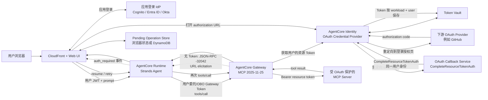
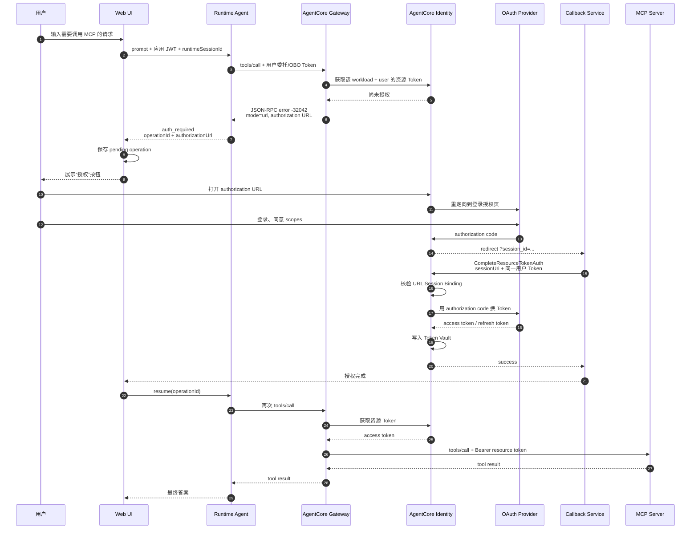

# AgentCore Gateway Outbound OAuth 端到端 Demo 架构

> 文档日期：2026-07-22
> 目标场景：云端 Agent 通过 AgentCore Gateway 调用受 OAuth 2.0 Authorization Code Flow 保护的 MCP Server

## 1. Overview

### 1.1 背景与目标

本文描述一个云端 Agent 使用 AgentCore Gateway 调用受 OAuth 保护的 MCP Server 的端到端 Demo 方案。目标用户体验如下：

1. 用户在 Web UI 中向云端 Agent 发起请求。
2. Agent 通过 MCP Gateway 首次调用受保护工具。
3. Gateway 返回授权 URL，Web UI 将其展示给用户。
4. 用户打开 URL，在下游 OAuth Provider 完成登录和授权。
5. 应用完成 Session Binding，并自动恢复尚未完成的 Agent 操作。
6. Gateway 使用 Token Vault 中该用户的资源 Token 调用 MCP Server。

在整个流程中，下游 OAuth access token 和 refresh token 仅由 AgentCore Identity 管理，不进入 Agent 上下文、浏览器或业务数据库。

### 1.2 文档范围

本文重点说明：

- Runtime Agent、Gateway、AgentCore Identity、Web UI、Callback Service 和 MCP Server 之间的职责边界。
- 首次授权、Session Binding、Token Vault 和授权后重试的完整时序。
- 两个官方 sample 分别提供了哪些能力，以及距离目标 Demo 还缺少什么。
- 多用户身份传递、OBO、Pending Operation、幂等重试和安全控制要求。
- 可用于验证完整流程的 E2E 验收标准。

### 1.3 官方参考与边界

官方仓库已经提供 Gateway outbound OAuth 3LO 和浏览器 URL elicitation 的核心参考实现，但目前没有一份 sample 同时封装“云端 Runtime Agent、Gateway outbound 3LO、最终用户 Web UI、云端 callback 和自动重试”全部环节。

本文以以下两个 sample 为基础，并补充 Runtime Agent、云端状态管理和用户级身份传递：

1. [GitHub MCP Authorization Code Flow](https://github.com/awslabs/agentcore-samples/tree/main/01-features/07-centralize-and-govern-your-ai-infrastructure/01-gateway/01-attach-targets/mcp/mcp-servers/01-configure-auth/authorization-code-flow/github)
2. [AgentCore Gateway MCP Inspector](https://github.com/awslabs/agentcore-samples/tree/main/01-features/07-centralize-and-govern-your-ai-infrastructure/01-gateway/05-community/gateway-mcp-inspector)

## 2. 总体架构



### 2.1 组件职责

| 组件 | 职责 | 不应承担的职责 |
|---|---|---|
| Web UI | 用户登录、展示授权 URL、保存待恢复操作、授权成功后触发重试 | 不保存下游 OAuth Token |
| AgentCore Runtime | 执行 Agent、调用 Gateway、把 URL elicitation 转换成结构化前端事件 | 不持久化 GitHub/Google access token |
| AgentCore Gateway | MCP 工具目录、调用路由、触发 outbound OAuth、向 MCP 注入资源 Token | 不负责渲染登录 UI |
| AgentCore Identity | OAuth Credential Provider、授权码交换、Session Binding、Token Vault | 不保存业务会话或待重试 prompt |
| Callback Service | 验证当前应用用户，调用 `CompleteResourceTokenAuth` | 不代理 Runtime 的长连接调用 |
| Pending Operation Store | 保存授权前未完成的操作及状态 | 不保存 OAuth client secret 或 provider token |
| MCP Server | 校验 Gateway 注入的 access token，执行工具 | 不信任未经验证的前端身份字段 |

## 3. 两类 Token 必须分清

整个架构中至少存在三类凭证：

| 凭证 | 使用链路 | 持有者 |
|---|---|---|
| 应用登录 Token | Browser -> Runtime | 浏览器，Runtime 仅用于验证调用者 |
| Gateway 调用 Token | Runtime -> Gateway | Runtime；应代表当前用户或可映射到当前用户 |
| 下游 Resource Token | Gateway -> MCP Server | AgentCore Identity / Gateway，Agent 不可见 |

### 3.1 多用户场景的关键约束

如果 Gateway 使用固定的 M2M Token 接收所有 Agent 调用，Token Vault 中的下游授权可能绑定到服务身份，而不是最终用户。单用户 Demo 可以工作，但不具备正确的多用户隔离。

生产方案必须满足：

1. Runtime 调 Gateway 时使用用户委托或 OBO Token。
2. Gateway 首次返回 URL elicitation 时，该 Token 对应当前最终用户。
3. Callback 调用 `CompleteResourceTokenAuth` 时，`userIdentifier.userToken` 必须表示同一个用户。
4. 重试工具调用时仍使用同一用户身份。

不能仅依赖 `runtimeSessionId` 作为用户身份。它用于运行时会话关联，不等价于 OAuth 用户身份。

## 4. 首次授权完整时序



## 5. 再次调用时序

授权完成后，同一用户再次调用相同 MCP Target：

1. Agent 调用 Gateway。
2. Gateway 按 workload 和用户身份从 Token Vault 获取 Token。
3. 如果 access token 已过期且 provider 返回了 refresh token，Identity 负责刷新。
4. Gateway 将 Token 注入下游请求。
5. MCP Server 返回结果。
6. 不再展示授权 URL，除非授权失效、scope 改变或用户撤销授权。

## 6. Sample 1 提供了什么

### 6.1 Sample

[Connecting GitHub MCP Server to AgentCore Gateway](https://github.com/awslabs/agentcore-samples/tree/main/01-features/07-centralize-and-govern-your-ai-infrastructure/01-gateway/01-attach-targets/mcp/mcp-servers/01-configure-auth/authorization-code-flow/github)

### 6.2 已提供的内容

| 能力 | 实现 |
|---|---|
| OAuth Credential Provider | 创建 `GithubOauth2` provider，保存 GitHub client ID/secret |
| Gateway | 创建 MCP Gateway，启用 `supportedVersions: ["2025-11-25"]` |
| Gateway Target | 连接 `https://api.githubcopilot.com/mcp` |
| Outbound Auth | Target 使用 `credentialProviderType: "OAUTH"` 和 `grantType: "AUTHORIZATION_CODE"` |
| Schema-upfront | 创建 Target 时直接提供工具 schema，避免部署时必须人工授权 |
| URL elicitation | 首次 `tools/call` 返回 JSON-RPC `-32042` 和授权 URL |
| Session Binding | Callback 调用 `complete_resource_token_auth` |
| Token Vault | 授权后由 AgentCore Identity 保存资源 Token |
| 重试示例 | 授权完成后再次运行 `invoke.py`，工具调用成功 |

关键源码：

- [deploy_credential.py](https://github.com/awslabs/agentcore-samples/blob/main/01-features/07-centralize-and-govern-your-ai-infrastructure/01-gateway/gatewaylabproject/scripts/github-auth-code/deploy_credential.py)
- [deploy_gateway.py](https://github.com/awslabs/agentcore-samples/blob/main/01-features/07-centralize-and-govern-your-ai-infrastructure/01-gateway/gatewaylabproject/scripts/github-auth-code/deploy_gateway.py)
- [deploy_target_schema.py](https://github.com/awslabs/agentcore-samples/blob/main/01-features/07-centralize-and-govern-your-ai-infrastructure/01-gateway/gatewaylabproject/scripts/github-auth-code/deploy_target_schema.py)
- [invoke.py](https://github.com/awslabs/agentcore-samples/blob/main/01-features/07-centralize-and-govern-your-ai-infrastructure/01-gateway/gatewaylabproject/scripts/github-auth-code/invoke.py)
- [callback_server.py](https://github.com/awslabs/agentcore-samples/blob/main/01-features/07-centralize-and-govern-your-ai-infrastructure/01-gateway/gatewaylabproject/scripts/github-auth-code/callback_server.py)

### 6.3 没有提供的内容

- 没有部署 AgentCore Runtime Agent。
- 调用端是 Python 脚本，不是面向最终用户的 Web UI。
- Callback 使用 localhost，不是云端 HTTPS callback。
- 授权完成后要求重新执行脚本，没有业务级自动重试状态机。
- 示例使用 Gateway 调用凭证演示流程，不等于完整的多用户 OBO 设计。

## 7. Sample 2 提供了什么

### 7.1 Sample

[AgentCore Gateway MCP Inspector](https://github.com/awslabs/agentcore-samples/tree/main/01-features/07-centralize-and-govern-your-ai-infrastructure/01-gateway/05-community/gateway-mcp-inspector)

### 7.2 已提供的内容

| 能力 | 实现 |
|---|---|
| Web UI | React 前端，可连接和调试 AgentCore Gateway |
| Gateway 连接 | Gateway 选择、MCP Streamable HTTP、工具列表和调用 |
| 多种 Gateway 入站认证 | Manual Token、OAuth、AgentCore Identity M2M、IAM SigV4 |
| URL elicitation UI | 解析 `-32042`，显示 URL、目标域名和 Open URL 按钮 |
| Callback 识别 | 从回调 URL 读取 `session_id` |
| Session Binding API | Node 服务提供 `/complete-token-auth` |
| AgentCore SDK 调用 | 后端执行 `CompleteResourceTokenAuthCommand` |
| 回调完成体验 | 成功后关闭授权 Tab 或返回工具页面 |

关键源码：

- [UrlElicitationRequest.tsx](https://github.com/awslabs/agentcore-samples/blob/main/01-features/07-centralize-and-govern-your-ai-infrastructure/01-gateway/05-community/gateway-mcp-inspector/client/src/components/UrlElicitationRequest.tsx)
- [OAuthCallback.tsx](https://github.com/awslabs/agentcore-samples/blob/main/01-features/07-centralize-and-govern-your-ai-infrastructure/01-gateway/05-community/gateway-mcp-inspector/client/src/components/OAuthCallback.tsx)
- [server/src/index.ts](https://github.com/awslabs/agentcore-samples/blob/main/01-features/07-centralize-and-govern-your-ai-infrastructure/01-gateway/05-community/gateway-mcp-inspector/server/src/index.ts)

### 7.3 没有提供的内容

- Inspector 是开发调试工具，不是最终用户 Agent Chat UI。
- 默认本地运行，后端使用本机 AWS 凭证。
- 不部署 AgentCore Runtime Agent。
- 不保存 Agent prompt、tool arguments 和业务 operation ID。
- 从当前实现看，Session Binding 成功后会回到工具页面，但不会自动重放原始 `tools/call`。

## 8. 两个 Sample 与目标 Demo 的能力矩阵

| 能力 | GitHub Auth Code Sample | Gateway MCP Inspector | 目标 E2E Demo |
|---|:---:|:---:|:---:|
| Gateway outbound auth code | 是 | 使用已有 Gateway | 是 |
| OAuth Credential Provider | 是 | 可查看/选择 | 是 |
| MCP URL elicitation | 是 | 是 | 是 |
| 展示并打开授权 URL | 命令行打印 | 是 | 是 |
| `CompleteResourceTokenAuth` | 是 | 是 | 是 |
| Token Vault | 是 | 间接使用 | 是 |
| 云端 Runtime Agent | 否 | 否 | 是 |
| 最终用户 Chat UI | 否 | 否，属于调试 UI | 是 |
| 云端 HTTPS callback | 否 | 否 | 是 |
| 自动恢复 Agent 操作 | 否，手工重跑 | 否，返回工具页 | 是 |
| 多用户 Token 隔离 | 未完整展示 | 未完整展示 | 必须 |
| 生产级 IAM 与审计 | 部分 | 部分 | 必须 |

## 9. 目标 Demo 需要补充的模块

### 9.1 Runtime Agent 的 Gateway Tool Adapter

不能简单地对 Gateway 响应调用 `raise_for_status()`。Adapter 必须先解析 JSON-RPC：

```python
async def call_gateway_tool(tool_name: str, arguments: dict, user_token: str):
    response = await gateway_client.call_tool(tool_name, arguments, user_token)
    error = response.get("error")

    if error and error.get("code") == -32042:
        elicitation = next(
            item
            for item in error.get("data", {}).get("elicitations", [])
            if item.get("mode") == "url"
        )
        return {
            "type": "auth_required",
            "authorization_url": elicitation["url"],
            "elicitation_id": elicitation.get("elicitationId"),
        }

    return {"type": "tool_result", "result": response["result"]}
```

Adapter 应向前端发送结构化控制事件，不应只让 LLM 把 URL 改写成自然语言。

### 9.2 Pending Operation 状态机

推荐状态：

```text
RUNNING
  -> AUTH_REQUIRED
  -> AUTHORIZING
  -> AUTHORIZED
  -> RETRYING
  -> SUCCEEDED
  -> FAILED / EXPIRED / CANCELLED
```

至少保存：

| 字段 | 用途 |
|---|---|
| `operation_id` | 前端和 Agent 关联同一次业务操作 |
| `user_subject` | 防止其他用户恢复该操作 |
| `runtime_session_id` | 保持 Agent 会话 |
| `prompt` 或 tool call 描述 | 授权后恢复 |
| `target_name` / `tool_name` | 可观测性与精确重试 |
| `status` | 状态机 |
| `expires_at` | 与授权 URL 有效期协调 |
| `idempotency_key` | 避免有副作用工具重复执行 |

Demo 可以先保存在浏览器 `sessionStorage`；多实例和多设备场景应使用 DynamoDB。

### 9.3 云端 Callback Service

OAuth Provider 的浏览器重定向不会自动携带应用的 `Authorization` Header，因此推荐拆成两个接口：

```http
GET /oauth/callback?session_id=<session-uri>

POST /api/oauth/complete
Authorization: Bearer <current-user-token>
Content-Type: application/json

{
  "session_uri": "<session-uri>",
  "operation_id": "<id>"
}
```

处理流程：

1. `GET /oauth/callback` 返回回调页面，不在 URL 中传递任何 Token。
2. 回调页面从 `sessionStorage` 或服务端 pending operation 中恢复 `operation_id`，并从现有应用登录会话取得或刷新应用 JWT。
3. 页面调用 `POST /api/oauth/complete`，在 Header 中发送 JWT。
4. Callback Service 验证应用 JWT。
5. 校验 `operation_id` 属于当前用户且未过期。
6. 获取与首次 Gateway 调用相同的用户委托/OBO Token。
7. 调用：

```python
client.complete_resource_token_auth(
    sessionUri=session_uri,
    userIdentifier={"userToken": gateway_user_token},
)
```

8. 将 operation 状态更新为 `AUTHORIZED`。
9. 返回成功结果，回调页面通知原页面或重定向到 Web UI。

Callback Service 只处理 OAuth 完成动作，不作为 Browser 到 Runtime 的同步代理。

### 9.4 前端自动重试

推荐流程：

1. 收到 `auth_required` 后保存 `operation_id` 和原始请求。
2. 展示明确的“授权 GitHub”按钮。
3. 使用新 Tab 打开授权 URL。
4. Callback 成功后通过页面跳转、轮询或 WebSocket 通知原页面。
5. 前端调用 Runtime 的 `resume(operation_id)`。
6. Agent 重新执行尚未完成的工具调用。
7. 成功后清理 pending operation。

“自动重试”应由应用层实现。不能假设 `CompleteResourceTokenAuth` 会恢复已经结束的 Agent 或 MCP 请求。

## 10. Gateway Target 配置骨架

```python
control.create_gateway(
    name="oauth-mcp-gateway",
    roleArn=gateway_role_arn,
    protocolType="MCP",
    authorizerType="CUSTOM_JWT",
    authorizerConfiguration={
        "customJWTAuthorizer": {
            "discoveryUrl": gateway_discovery_url,
            "allowedClients": [gateway_client_id],
        }
    },
    protocolConfiguration={
        "mcp": {
            "supportedVersions": ["2025-11-25"],
            "searchType": "SEMANTIC",
        }
    },
)

control.create_gateway_target(
    gatewayIdentifier=gateway_id,
    name="github-mcp",
    targetConfiguration={
        "mcp": {
            "mcpServer": {
                "endpoint": "https://api.githubcopilot.com/mcp",
                "mcpToolSchema": {"inlinePayload": github_tool_schema},
            }
        }
    },
    credentialProviderConfigurations=[
        {
            "credentialProviderType": "OAUTH",
            "credentialProvider": {
                "oauthCredentialProvider": {
                    "providerArn": credential_provider_arn,
                    "grantType": "AUTHORIZATION_CODE",
                    "defaultReturnUrl": "https://demo.example.com/oauth/callback",
                    "scopes": ["repo", "user", "workflow"],
                }
            },
        }
    ],
)
```

生产环境应使用实际支持的 scopes，并根据当前 AgentCore API 模型校验字段。建议采用 schema-upfront 模式，避免 IaC 部署过程被人工授权阻塞。

## 11. 推荐部署形态

```text
CloudFront
  +-- S3 private origin：React Web UI
  +-- /oauth/callback：受保护的 Callback API

Cognito / Enterprise IdP
  +-- Web UI 登录
  +-- Runtime inbound auth
  +-- 用户委托/OBO Gateway identity

AgentCore Runtime
  +-- Strands Agent
  +-- Gateway Tool Adapter
  +-- structured auth_required event

AgentCore Gateway
  +-- CUSTOM_JWT inbound auth
  +-- MCP protocol 2025-11-25
  +-- GitHub MCP Target
  +-- AUTHORIZATION_CODE outbound auth

AgentCore Identity
  +-- GitHub OAuth Credential Provider
  +-- CompleteResourceTokenAuth
  +-- Token Vault

DynamoDB
  +-- pending operations
  +-- idempotency and expiry
```

Browser 应直接调用 AgentCore Runtime，不要使用 API Gateway + Lambda 作为 Runtime 的同步代理。OAuth Callback API 是短请求，不受该限制。

## 12. 安全要求

1. **同一用户绑定**：首次 Gateway 调用、`CompleteResourceTokenAuth` 和重试必须使用同一最终用户身份。
2. **HTTPS callback**：生产回调必须使用 HTTPS，并加入允许的 return URL 列表。
3. **不暴露 provider token**：下游 access token、refresh token 和 client secret 不进入浏览器、Agent prompt、日志或业务数据库。
4. **授权 URL 短时有效**：授权 URL 和 session URI 应按短生命周期处理；过期后重新发起。
5. **最小权限 scopes**：只申请 MCP 工具实际需要的 scope。
6. **防止开放重定向**：callback 仅允许固定前端地址，不接受任意 `return_to`。
7. **防止跨用户恢复**：`operation_id` 必须绑定 `user_subject`。
8. **幂等重试**：写操作必须带 idempotency key。
9. **IAM 最小权限**：
   - Runtime Role 仅可调用指定 Gateway。
   - Gateway Role 仅可访问指定 Credential Provider、Token Vault 和 Target。
   - Callback Role 仅可执行所需的 `CompleteResourceTokenAuth`。
10. **审计**：CloudTrail/CloudWatch 记录授权触发、Session Binding、Gateway tool call 和重试结果，但不记录 Token。

## 13. E2E 验收标准

| 编号 | 场景 | 预期结果 |
|---|---|---|
| E2E-01 | 未授权用户首次调用 GitHub MCP 工具 | Gateway 返回 `-32042`，UI 显示授权按钮 |
| E2E-02 | 用户点击授权 URL | 打开正确 OAuth Provider 和 scopes |
| E2E-03 | 用户完成登录授权 | Callback 收到 `session_id`，Session Binding 成功 |
| E2E-04 | 授权后恢复操作 | 应用自动重试，Agent 获得 MCP 结果 |
| E2E-05 | 同一用户再次调用 | 不再展示授权 URL |
| E2E-06 | 另一个用户调用 | 不复用第一个用户的 Token |
| E2E-07 | 使用错误用户完成 callback | Session Binding 被拒绝 |
| E2E-08 | 授权 URL 过期 | UI 提示重新授权，不无限重试 |
| E2E-09 | 用户撤销 provider 授权 | 下次调用重新触发授权 |
| E2E-10 | 有副作用工具发生网络重试 | idempotency key 防止重复执行 |
| E2E-11 | 检查日志 | 不包含 access token、refresh token 或 client secret |

## 14. 实施顺序

1. 直接部署并验证 GitHub Authorization Code Flow sample。
2. 使用 MCP Inspector 验证 URL elicitation 和 Session Binding。
3. 部署一个最小 AgentCore Runtime Agent，并接入 Gateway。
4. 在 Agent 中实现 `-32042` 解析和结构化 `auth_required` 事件。
5. 将 Inspector 的 URL elicitation UI 和 callback 思路移植到 Chat UI。
6. 将 localhost callback 替换为云端 HTTPS callback。
7. 增加 pending operation 和自动重试。
8. 将 Gateway 调用身份升级为用户委托/OBO，完成多用户隔离。
9. 执行 E2E、安全和 Token 泄露检查。

## 15. 对外说明建议

> 我们可以提供完整的端到端 Demo。Agent 部署在 AgentCore Runtime，并通过 MCP Gateway 调用受 OAuth 保护的 MCP Server。首次调用时，Gateway 通过 MCP URL-mode elicitation 返回授权 URL；前端展示该 URL，用户完成登录和授权。回调服务调用 `CompleteResourceTokenAuth` 完成用户 Session Binding，资源 Token 由 AgentCore Identity Token Vault 托管。授权完成后，应用恢复并重试原操作，Gateway 代表该用户调用 MCP，Agent 和前端均不接触下游 OAuth Token。
>
> 该方案基于两个官方参考：GitHub MCP Authorization Code Flow sample 提供 Gateway outbound 3LO、URL elicitation、Session Binding 和 Token Vault 链路；Gateway MCP Inspector 提供 URL 展示、浏览器交互和 callback UI。我们的集成部分补充云端 Runtime Agent、HTTPS callback、用户级 OBO 身份传递和自动重试状态机。

## 16. 参考资料

- [Auth Code Flow with MCP Targets](https://github.com/awslabs/agentcore-samples/tree/main/01-features/07-centralize-and-govern-your-ai-infrastructure/01-gateway/01-attach-targets/mcp/mcp-servers/01-configure-auth/authorization-code-flow)
- [GitHub MCP Authorization Code Sample](https://github.com/awslabs/agentcore-samples/tree/main/01-features/07-centralize-and-govern-your-ai-infrastructure/01-gateway/01-attach-targets/mcp/mcp-servers/01-configure-auth/authorization-code-flow/github)
- [AgentCore Gateway MCP Inspector](https://github.com/awslabs/agentcore-samples/tree/main/01-features/07-centralize-and-govern-your-ai-infrastructure/01-gateway/05-community/gateway-mcp-inspector)
- [OAuth 2.0 authorization URL session binding](https://docs.aws.amazon.com/bedrock-agentcore/latest/devguide/oauth2-authorization-url-session-binding.html)
- [Gateway outbound authentication](https://docs.aws.amazon.com/bedrock-agentcore/latest/devguide/gateway-outbound-auth.html)
- [MCP URL-mode elicitation](https://modelcontextprotocol.io/specification/2025-11-25/client/elicitation#url-mode-flow)
