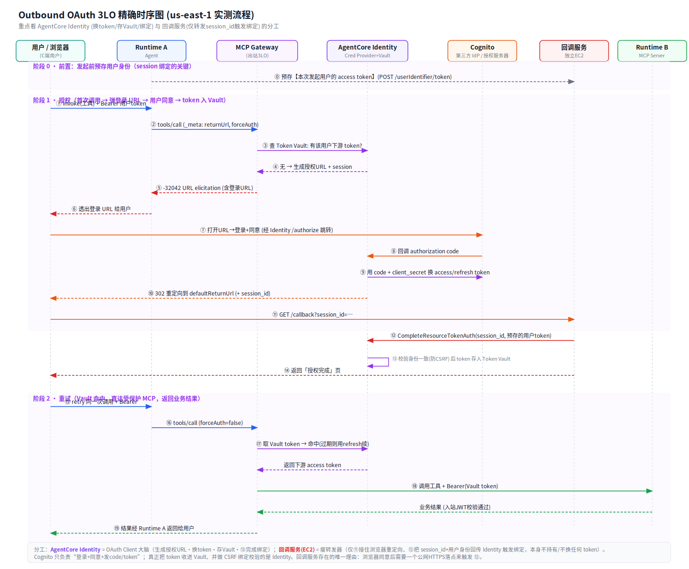

# Outbound OAuth 3LO 实战教学：AgentCore Gateway 如何用"用户授权码流"访问受保护 MCP

> 本文是 `identity-outbound` 分支的**教学主文档**，用一个真实部署、真实实测的端到端案例，带你搞懂：
> 1. **Inbound（入站）vs Outbound（出站）授权**到底差在哪；
> 2. **3LO（三腿授权 / authorization_code）** 与 2LO（client_credentials）的区别；
> 3. AgentCore 的 **OAuth2 Credential Provider** 是什么、为什么它 ≠ Cognito；
> 4. Gateway 如何用 **`-32042` URL elicitation** 把"请登录"这段 URL 抛给调用方；
> 5. **Token Vault + session 绑定**如何让"授权一次、后续免打扰"且防 CSRF；
> 6. 为什么下游要用**另一个 AgentCore Runtime 承载 MCP Server**（而非 Lambda）。
>
> 全部资源部署在 **us-east-1**，基于 **Amazon Cognito(Hosted UI) + AgentCore Identity + AgentCore Gateway + 两个 AgentCore Runtime**。配套可跑命令见 [OUTBOUND_RUNBOOK.md](OUTBOUND_RUNBOOK.md)。

---

## 目录

- [1. 场景与拓扑](#1-场景与拓扑)
- [2. Inbound vs Outbound Auth](#2-inbound-vs-outbound-auth)
- [3. 2LO vs 3LO](#3-2lo-vs-3lo)
- [4. 【重点】OAuth2 Credential Provider ≠ Cognito](#4-重点oauth2-credential-provider--cognito)
- [5. 【重点】-32042 URL Elicitation：登录 URL 怎么抛出来的](#5-重点-32042-url-elicitation登录-url-怎么抛出来的)
- [5.5 精确时序图](#55-精确时序图)
- [6. Token Vault 与 Session 绑定](#6-token-vault-与-session-绑定)
- [6.5 【重点】AgentCore Identity 的作用 & 与回调服务的分工](#65-重点agentcore-identity-的作用--与回调服务的分工)
- [7. 为什么下游用 Runtime 承载 MCP Server](#7-为什么下游用-runtime-承载-mcp-server)
- [8. 端到端实测结果](#8-端到端实测结果)
- [9. 【重点】关键代码解读](#9-重点关键代码解读)
- [10. 复现与踩坑](#10-复现与踩坑)

---

## 1. 场景与拓扑

目标效果：**Agent 去调某个 MCP 工具时，若用户尚未授权，会出现一段 URL 让用户点开登录；授权后 Agent 才能正常调用。**

```
  用户(浏览器) ──①调用──> Runtime A (Agent)
                              │ ②经 MCPClient/裸MCP 调 Gateway tools/call
                              ▼
                        MCP Gateway (outbound OAuth 3LO)
                              │ ③Vault 无 token -> 返回 -32042 + 登录URL
                              ▼（授权后）用 Vault token(Bearer) 调下游
                        Runtime B (受 OAuth 保护的 MCP Server)
  用户 ──④点登录URL──> Cognito Hosted UI 登录同意
       ──⑤重定向──> callback.chrisai.blog(独立EC2) -> CompleteResourceTokenAuth -> token入Vault
```

一句话：**agent → gateway → agent**，中间那跳的"出站授权"需要用户亲自点 URL 授权一次。

---

## 2. Inbound vs Outbound Auth

AgentCore 的认证分两个方向，务必分清（这也是与旧 `cognito-test` 分支最大的不同——那条链路只讲 inbound）：

| | Inbound（入站） | **Outbound（出站）** |
|---|---|---|
| 问题 | "谁能调用我（Runtime/Gateway）" | "我（Gateway）用什么身份去调下游资源" |
| 用谁的身份 | 调用方（用户）的 token | Gateway 代表用户拿到的**下游授权 token** |
| 机制 | `customJWTAuthorizer`（验签/iss/aud） | **凭证提供者 + Token Vault**（API Key / OAuth 2LO / **3LO**） |
| 本例体现 | Runtime A/B、Gateway 都配了入站 Cognito JWT 校验 | Gateway target 配 `OAUTH / AUTHORIZATION_CODE`，代表用户拿下游 token |

**本 demo 的重点是 Outbound**：Gateway 需要一个"用户授权过的" token 才能访问受保护的下游 MCP（Runtime B）。

---

## 3. 2LO vs 3LO

OAuth 出站有两种"腿数"：

| | 2LO（client_credentials） | **3LO（authorization_code）** |
|---|---|---|
| 参与方 | 2 方：Gateway ↔ 授权服务器 | **3 方：用户 + Gateway + 授权服务器** |
| 需要用户点同意吗 | 否（M2M，机器身份） | **是（用户在浏览器登录、点授权）** |
| 典型场景 | 服务对服务 | 代表用户访问其个人资源（LinkedIn/Google/…） |
| 是否弹 URL | 不弹 | **弹登录 URL（本 demo 的主角）** |

本 demo 要的正是"弹 URL 让用户登录"，所以 target 用 **`grantType=AUTHORIZATION_CODE`**。

---

## 4. 【重点】OAuth2 Credential Provider ≠ Cognito

这是最容易混的点。两个"provider"名字撞车，实为不同层面：

| | **Cognito**（授权服务器 / IdP） | **AgentCore OAuth2 Credential Provider** |
|---|---|---|
| 角色 | OAuth **Authorization Server**（发 token 的一方） | AgentCore 作为 OAuth **Client** 的一张"凭证登记卡" |
| 有登录页吗 | 有（Hosted UI，用户在此登录同意） | 没有——它不发 token、不存用户 |
| 存什么 | 用户、密码、resource server、scope | client_id / client_secret / discoveryUrl / scope |
| 产出 | authorization code、access/refresh token | **一个唯一的 callback URL**（要回填到 Cognito） |

类比：**Cognito 是发身份证的机关；Credential Provider 是你在这个机关登记的"办事账号"**。两个都要有。

创建（本例 `CustomOauth2` + Cognito discoveryUrl）：

```bash
aws bedrock-agentcore-control create-oauth2-credential-provider \
  --name okx-ob-cognito-provider --credential-provider-vendor CustomOauth2 \
  --oauth2-provider-config-input '{"customOauth2ProviderConfig":{
     "oauthDiscovery":{"discoveryUrl":"<COGNITO_DISCOVERY_URL>"},
     "clientId":"<APP_CLIENT_ID>","clientSecret":"<SECRET>"}}'
# 返回里的 callbackUrl 必须回填到 Cognito App Client 的 CallbackURLs
```

> 它独有的 3 个作用：① 安全存 client_secret（进 Secrets Manager）；② 产出 3LO 重定向锚点 callback URL；③ 管 Token Vault（按 provider+用户存 token）。

---

## 5. 【重点】-32042 URL Elicitation：登录 URL 怎么抛出来的

当 `tools/call` 命中一个 `AUTHORIZATION_CODE` 的 target，且 Vault 里没有该用户的下游 token 时，Gateway 会返回一个 **MCP URL 模式 elicitation 错误 `-32042`**（需 Gateway 建在 MCP 协议版本 **`2025-11-25`** 上）：

```json
{"jsonrpc":"2.0","id":24,"error":{
  "code":-32042,"message":"This request requires more information.",
  "data":{"elicitations":[{"mode":"url","elicitationId":"…",
    "url":"https://bedrock-agentcore.us-east-1.amazonaws.com/identities/oauth2/authorize?request_uri=urn:ietf:…",
    "message":"Please login to this URL for authorization."}]}}}
```

调用方（Runtime A / 测试脚本）拿到这个 `url` 就展示给用户。用户点开后：
`AgentCore /authorize` → 重定向 Cognito Hosted UI 登录同意 → 回 AgentCore callback（换 code 拿 token）→ 重定向到 target 的 `defaultReturnUrl`（我们的回调服务器）。

**关键工程点**：
- 请求要带头 `MCP-Protocol-Version: 2025-11-25` 和 `Accept: application/json, text/event-stream`，否则报 `-32022`。
- 可用 `params._meta` 覆盖：`returnUrl`（临时改回调）、`forceAuthentication:true`（清 Vault，强制每次弹 URL，**演示利器**）。
- Strands 旧版 `MCPClient` 会把 `-32042` 吞成一句话丢掉 URL（sdk-python #1742，PR #1745 修复）。本 demo 的 Runtime A 用裸 MCP 发 `tools/call` 并自己解析 `elicitations[].url`，保证稳定拿到登录 URL。

---

## 5.5 精确时序图

下图是本次 us-east-1 实测流程的**精确时序**，覆盖 user/浏览器、Runtime A、MCP Gateway、AgentCore Identity、第三方 IdP(Cognito)、回调服务、Runtime B 七方，分三个阶段（前置预存 / 授权 / 重试）。**重点看紫色的 AgentCore Identity 与红色的回调服务各自做了什么**（详见 §6.5）。



一句话读图：
- **阶段 0（⓪）**：发起前先把「本次发起用户的 token」预存到回调服务（session 绑定的锚点，漏了这步 → 后面 ⑫ 报 500）。
- **阶段 1（①–⑭）授权**：调用 → Gateway 查 Vault 无 token → Identity 生成授权 URL → Gateway 用 `-32042` 抛给用户 → 用户在 Cognito 登录同意 → Identity 换 token → 浏览器落到回调服务 → 回调触发 Identity 完成 **session 绑定并把 token 存进 Vault**。
- **阶段 2（⑮–⑲）重试**：Gateway 命中 Vault token → 作为 Bearer 调 Runtime B → 过其入站 JWT 校验 → 返回业务结果。

---

## 6. Token Vault 与 Session 绑定

- 用户授权后，AgentCore Identity 把 access/refresh token 存进 **Token Vault**，按 **provider + 用户身份** 归档。
- 之后同一用户再调，Gateway 直接取 Vault 里的 token（过期用 refresh token 续），**不再弹 URL**。
- **Session 绑定（防 CSRF）**：3LO 授权 URL 有效期约 10 分钟；必须证明"发起授权的用户 = 完成同意的用户"。做法：
  1. 发起 3LO 前，把发起用户的 access token POST 到回调服务器（`/userIdentifier/token`）暂存；
  2. 浏览器带 `session_id` 落到回调服务器时，用它作为 `user_identifier` 调 **`CompleteResourceTokenAuth(session_uri, user_identifier)`** 完成绑定。
- 回调服务器必须是**公网可达的 HTTPS**，且其 URL 要注册进 Gateway workload identity 的 `allowedResourceOauth2ReturnUrls`。本例用独立 EC2 + `callback.chrisai.blog` + Let's Encrypt（Caddy 自动签发）。

---

## 6.5 【重点】AgentCore Identity 的作用 & 与回调服务的分工

> 这是最容易困惑的地方：**既然 AgentCore Identity 会换 token、存 Vault，那为什么还要我自己搭一个回调服务？两者到底谁干什么？**

### AgentCore Identity 是"OAuth Client 的大脑 + 保险柜"

它是本方案的核心托管服务，替你做了自己写 OAuth Client 时最麻烦的一堆事：

| Identity 的职责 | 对应时序图 | 说明 |
|---|---|---|
| **生成授权 URL** | ④ | 按 credential provider 里登记的 client_id / scope / discoveryUrl，拼出去 Cognito 的授权 URL，并起一个 `session` 跟踪本次流程 |
| **持有 client_secret** | ⑨ | secret 存在它的 Secrets Manager 里，换 token 时它来用——**你的代码永远碰不到 secret** |
| **拿 code 换 token** | ⑨ | 收到 Cognito 回来的 authorization code，向 Cognito token 端点换 access/refresh token |
| **CSRF 绑定校验** | ⑬ | 校验"完成同意的身份 = 发起授权的身份"，通过才认这次授权 |
| **存 Token Vault** | ⑬ | 把 token 按 `provider + 用户` 归档；后续过期自动用 refresh token 续 |
| **命中/下发 token** | ⑰ | 重试时直接把 Vault 里的下游 token 给 Gateway |

**一句话：换 token、验身份、存 token、续 token 全是 Identity 干的。** 你不需要写任何"OAuth client 换码换 token"的代码。

### 那回调服务（EC2）到底干嘛？—— 它是个"瘦转发器"，不碰 token

回调服务**唯一存在的理由**：OAuth 授权码流规定"用户在浏览器同意后，浏览器要被重定向到一个 URL"。这个 URL 必须是**公网可达的 HTTPS 落点**——AgentCore Identity 不会替你在公网上开一个"用户浏览器能直接访问的页面"，所以这一个落点得你自己提供。

它做的事极少（见 `callback_server.py`，全部逻辑就几行）：

| 回调服务的职责 | 对应时序图 | 说明 |
|---|---|---|
| 接住浏览器重定向 | ⑪ | `GET /callback?session_id=…`——从 URL 里拿到 Identity 之前起的那个 `session_id` |
| 回传给 Identity 触发绑定 | ⑫ | 调 `CompleteResourceTokenAuth(session_id, 用户身份)` —— 把"这个 session 是谁完成的"告诉 Identity |
| 给用户一个反馈页 | ⑭ | 返回「授权完成」HTML，让用户知道可以回去重试了 |

**它不换 token、不存 token、不碰 client_secret、不访问 Vault。** 它只是把浏览器带回来的 `session_id` 和"发起用户是谁"这两条信息回传给 Identity，由 Identity 去完成真正的绑定和存储。

### 为什么这一步不能省 / 不能让 Identity 自己做？

- **公网落点**：`session_id` 是随浏览器重定向回来的，必须有一个**用户浏览器能直连**的 HTTPS 端点接住它。Identity 是控制面 API（用 SigV4 签名调用），不是给浏览器直接访问的网页，所以需要你提供这个落点。
- **CSRF 绑定的"人证"**：`CompleteResourceTokenAuth` 需要传入"发起这次授权的用户身份"（本例是发起时预存的那个用户 access token）。回调服务就是那个"记得发起人是谁、又恰好接住了浏览器回跳"的中间人——把两者拼起来交给 Identity 校验。这也是为什么**发起前必须预存本次的 token**（阶段 0 的 ⓪），否则 ⑫ 会因身份对不上而报 `Invalid or expired session`（我们真实踩过的 500）。

### 一张图记住分工

```
Cognito(第三方IdP)  ── 只负责：登录页 + 用户同意 + 发 code/token
AgentCore Identity ── OAuth Client 大脑：生成授权URL·持secret·换token·验CSRF·存/续 Vault
回调服务(你的EC2)   ── 瘦转发器：接住浏览器 session_id → 回传 Identity 触发绑定 (不碰token)
MCP Gateway        ── 出站执行：查/用 Vault token，未授权时用 -32042 抛登录URL
```

> 类比：Identity 是"银行后台"（真正管账户、发钱、核身份）；回调服务是"营业厅门口的取号回执机"——它只把你手里的号（session_id）和你是谁递进后台，钱（token）从头到尾在后台，不经过它的手。

---

## 7. 为什么下游用 Runtime 承载 MCP Server

**3LO 只支持 MCP-server 与 OpenAPI target，不支持 Lambda target**。所以受保护的下游不能是 Lambda，得是一个真正的 MCP server。本例把它部署成**第二个 AgentCore Runtime**（`serverProtocol=MCP`）：

- 用 FastMCP 暴露 streamable-http（容器内 **8000/mcp**，`stateless_http=True`）；
- Runtime 的入站 `customJWTAuthorizer` 负责验 token——Gateway 出站拿到的 token 作为 `Authorization: Bearer` 打进来，正好过它的入站校验；
- 于是形成 **agent → gateway → agent** 的联邦：一个 Runtime 通过 Gateway 调另一个 Runtime 上的 MCP 工具。

> 这是 AWS 官方 sample `02-AgentCore-gateway/05-mcp-server-as-a-target` 的模式：Gateway `mcpServer` target 的 `endpoint` 指向另一个 Runtime 的 `/invocations` URL。

---

## 8. 端到端实测结果

| 步骤 | 现象 | 结果 |
|------|------|:---:|
| Runtime B 无 token | HTTP 401 | ✅ |
| Runtime B 有 token tools/call | get_token_price=$64250 | ✅ |
| Gateway 首次 tools/call（未授权） | **-32042 + 登录 URL** | ✅ |
| Runtime A 首次调用（产品形态） | `AUTHORIZATION_REQUIRED` + authorization_url | ✅ |
| 浏览器登录同意 → 回调 | 「✅ 授权完成」+ session 绑定 | ✅ |
| 授权后重试 tools/call | 成功返回业务结果，无 -32042 | ✅ |
| 二次调用 | Vault 命中，免授权 | ✅ |
| Runtime A 授权后 place_order | `status:OK` + MOCK_ACCEPTED | ✅ |

**同一段 Agent 代码，未授权时抛登录 URL、授权后直接可用**——出站授权闭环完整。

---

## 9. 【重点】关键代码解读

本节把整个链路里**最核心的几段代码**摘出来逐行讲。所有片段都来自本 repo 实测跑通的文件。

### 9.1 触发 3LO 并解析登录 URL（`e2e_3lo_test.py` / `agent.py`）

**(a) 用 `_meta` 告诉 Gateway 用哪种出站授权、回调去哪**

```python
def _meta(force):
    return {"aws.bedrock-agentcore.gateway/credentialProviderConfiguration":
            {"oauthCredentialProvider": {"returnUrl": RETURN_URL,          # 用户同意后浏览器落点(我们的回调服务)
                                         "forceAuthentication": force}}}   # True=清Vault强制重授权(演示利器)
```
- 这个 `_meta` 挂在 `tools/call` 的 `params` 里，是**逐次调用级**覆盖 Gateway target 默认配置的开关。
- `returnUrl` 覆盖 target 的 `defaultReturnUrl`；`forceAuthentication:true` 让 Gateway 忽略 Vault 缓存、每次都重新弹 URL——演示时用它保证每次都能看到登录 URL。

**(b) 发 `tools/call`，兼容 SSE，拿回 JSON-RPC 响应**

```python
def invoke_mcp(token, method, params):
    payload = {"jsonrpc": "2.0", "id": 24, "method": method, "params": params}
    req = urllib.request.Request(GW_URL, data=json.dumps(payload).encode(),
        headers={"Content-Type": "application/json",
                 "Authorization": f"Bearer {token}",                 # ← 入站身份：调用方(用户)的 Cognito token
                 "Accept": "application/json, text/event-stream",     # ← 缺它 Gateway 报 -32011
                 "MCP-Protocol-Version": "2025-11-25"})               # ← 缺它 Gateway 报 -32022, 3LO 也不触发
    try:
        with urllib.request.urlopen(req, timeout=60) as resp:
            raw = resp.read().decode()
    except urllib.error.HTTPError as e:
        raw = e.read().decode()                       # -32042 是 JSON-RPC error, HTTP 层可能非200, 也要读 body
    for line in raw.splitlines():                     # 兼容 SSE: "data: {...}"
        if line.strip().startswith("data:"):
            return json.loads(line.strip()[len("data:"):].strip())
    return json.loads(raw)
```
> 三个 header 缺一不可——这是踩坑重灾区：`Authorization` 决定入站身份，`Accept` 决定能否返回 SSE，`MCP-Protocol-Version: 2025-11-25` 是 **3LO / `-32042` 能力的开关**。

**(c) 从 `-32042` 响应里提取登录 URL**

```python
def extract_auth_url(resp):
    err = resp.get("error") or {}
    if err.get("code") == -32042:                                  # URL elicitation
        els = (err.get("data") or {}).get("elicitations") or []
        if els:
            return els[0].get("url")                               # 这段就是"让用户点开登录"的 URL
    return None
```
- Gateway 把"需要用户授权"表达为一个**结构化的 JSON-RPC 错误**（不是普通失败），登录 URL 藏在 `error.data.elicitations[0].url`。
- **这就是你要的"打印 URL 的代码"**：判断 `code == -32042` → 取 `elicitations[0].url` → 展示给用户。

### 9.2 一步到位发起（预存 + 触发 + 打印 URL）—— 修复手动演示 500 的关键

```python
def cmd_start():
    tok = get_token()                 # 取【本次发起用户】的 access token
    _prestore(tok)                    # ★ 立刻把它预存到回调服务(/userIdentifier/token) —— session 绑定的"人证"
    r = invoke_mcp(tok, "tools/call",
                   {"name": TOOL, "arguments": {"symbol": "BTC"}, "_meta": _meta(True)})
    url = extract_auth_url(r)         # 从 -32042 里取登录 URL
    print(url)                        # 用户点它去登录
```
> 顺序至关重要：**先取 token → 立刻预存 → 再触发**，三步用的是同一个身份。之前手动演示 500，正是因为发起前没预存本次 token，回调时身份对不上（见 §6.5 / §10 踩坑 5）。

### 9.3 retry 代码：授权后 Vault 命中，直达业务结果

```python
def cmd_retry():
    tok = get_token()
    r = invoke_mcp(tok, "tools/call",
                   {"name": TOOL, "arguments": {"symbol": "BTC"},
                    "_meta": _meta(False)})            # ← forceAuthentication=False: 允许命中 Vault 缓存
    if "result" in r and not r.get("error"):
        print("✅ 授权后调用成功 (Vault 命中, 未再弹 URL)")
    return r
```
- 与首次调用**唯一的区别是 `forceAuthentication=False`**：这次允许 Gateway 用 Vault 里已存的 token。
- 若 Vault 有该用户 token（授权已完成）→ 返回 `result`；若没有 → 又回到 `-32042`。**这就是你要的"retry 的代码"**。

### 9.4 回调服务核心：接住 session_id → 触发 Identity 完成绑定（`callback_server.py`）

```python
@self.app.get("/callback")
async def callback(session_id: str = None, sessionUri: str = None):
    sid = session_id or sessionUri                      # 浏览器重定向带回来的 session 标识
    # ★核心: 把 session_id + 发起用户身份 交给 AgentCore Identity 完成 session 绑定
    self.identity.complete_resource_token_auth(
        session_uri=sid,
        user_identifier=self.user_token_identifier)     # 预存的发起用户 token —— 证明"发起人=完成人"
    return HTMLResponse("<h1>✅ 授权完成</h1>")           # 只给用户一个反馈页
```
- 回调服务**全部实质逻辑就这一句** `complete_resource_token_auth`——它不换 token、不碰 Vault，只是把浏览器带回来的 `session_id` 和"发起用户是谁"回传给 **AgentCore Identity**，由 Identity 去做真正的 CSRF 绑定校验 + 存 Vault（见 §6.5 分工）。

### 9.5 Runtime B：受保护 MCP Server 本体（`mcp_server.py`）

```python
from mcp.server.fastmcp import FastMCP
mcp = FastMCP(host="0.0.0.0", port=8000, stateless_http=True)   # AgentCore MCP runtime 约定: 8000/mcp, 无状态

@mcp.tool()
def get_token_price(symbol: str) -> dict:
    ...
    return {"symbol": s, "price_usd": price, "source": "okx-ob-mcp-server"}

if __name__ == "__main__":
    mcp.run(transport="streamable-http")                         # 暴露 /mcp streamable-http 端点
```
> **注意这里没有任何鉴权代码**——入站 JWT 校验由 AgentCore Runtime 的 `customJWTAuthorizer` 在容器外完成（无有效 token 根本进不来）。业务代码只管工具逻辑，这正是"平台托管入站认证"的价值。

---

## 10. 复现与踩坑

```bash
export AWS_REGION=us-east-1
./deploy_ob.sh              # 建 Cognito + credential provider + 2 Runtime + Gateway(3LO)
./setup_callback_ec2.sh     # 起回调 EC2 + callback.chrisai.blog + 证书
# 验证见 OUTBOUND_RUNBOOK.md（Step 2 弹 URL / Step 4 人工登录 / Step 5 成功）
./cleanup_ob.sh             # 演示后清理（含独立 EC2, 务必删）
```

**实测踩坑（本例结论）**：
1. Gateway 3LO 需 MCP 协议头 `MCP-Protocol-Version: 2025-11-25`，否则 `-32022`。
2. MCP runtime 监听 **8000/mcp**（不是 8080）；请求 `Accept` 须含 `text/event-stream`。
3. `mcpServer` target 的 `mcpToolSchema.inlinePayload` 是 JSON **字符串** `{"tools":[…]}`（与 Lambda target 的数组不同）。
4. 回调 EC2 的 IAM 角色需 `bedrock-agentcore:CompleteResourceTokenAuth` + `secretsmanager:GetSecretValue`（`bedrock-agentcore-identity*`），否则回调 500。
5. `forceAuthentication:true` 用于演示——保证每次都弹 URL；生产用 false 走 Vault 缓存。
6. 未遇到 issue #809 的 `-32603`；3LO 打自建 Cognito-backed runtime target 实测可行。

---

*本文全部结论来自 us-east-1 的真实部署与实测（2026-07-22）；关键证据见 `VERIFICATION_OB.md`。*
