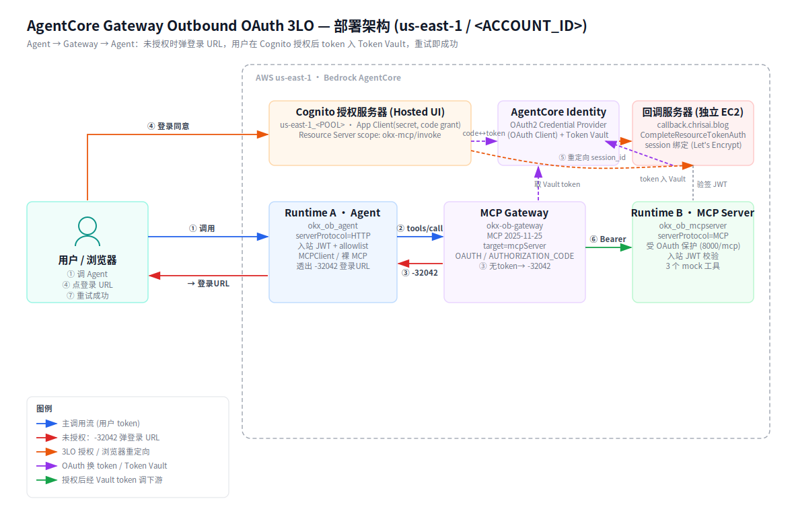

# Outbound OAuth 3LO — 人工 Live Demo 手册（可直接复制执行）

## 本次部署环境架构图



> 上图为本次 us-east-1 实际部署的资源与调用流：底部 `用户 → Runtime A(Agent) → MCP Gateway → Runtime B(受保护 MCP Server)` 是主链路；顶部 `Cognito 授权服务器 / AgentCore Identity(Credential Provider + Token Vault) / 回调 EC2` 是 3LO 授权侧。序号 ①–⑦ 对应下方 Step。

---

> 配合 [OUTBOUND_GUIDE.md](OUTBOUND_GUIDE.md)：**GUIDE 讲原理，本手册给"直接能跑"的命令**。
> 参数**已填好本次部署的真实值**，在这台已配好 AWS 凭证的机器（`/home/ec2-user/agentcore-outbound/identity/outbound`）逐条复制粘贴即可。
>
> **主线（一句话）**：Agent 去调 MCP 工具 → 因未授权，弹出一段**登录 URL** → 用户点开、在 Cognito 登录同意 → Agent 重试即成功。
>
> **演示区域**：`us-east-1` ｜ **账号**：`340636688520`

---

## 本次部署的资源清单（速查）

| 资源 | 值 |
|------|----|
| Cognito User Pool（授权服务器） | `us-east-1_D9GxixyVC`（ESSENTIALS，带 Hosted UI） |
| Hosted UI 域名 | `https://okx-ob-688520.auth.us-east-1.amazoncognito.com` |
| App Client（带 secret，code grant） | `5tq13k2uvhtr451s5q74vihi0` |
| Resource Server scope | `okx-mcp/invoke` |
| **AgentCore OAuth2 Credential Provider** | `okx-ob-cognito-provider` |
| AgentCore callback URL（已回填 Cognito） | `…/identities/oauth2/callback/9751974d-…` |
| **Runtime B（受保护 MCP Server）** | `arn:aws:bedrock-agentcore:us-east-1:340636688520:runtime/okx_ob_mcpserver-66faIiBfdR` |
| **MCP Gateway（outbound 3LO）** | `https://okx-ob-gateway-apmzxkiab4.gateway.bedrock-agentcore.us-east-1.amazonaws.com/mcp` |
| Gateway target（mcpServer，AUTHORIZATION_CODE） | `okxmcp`（id `VYGWJZ4KZL`） |
| **Runtime A（Agent，产品入口）** | `arn:aws:bedrock-agentcore:us-east-1:340636688520:runtime/okx_ob_agent-FJP3rb8S4C` |
| **回调服务器（独立 EC2）** | `https://callback.chrisai.blog/callback`（EIP `54.209.241.213`，`i-00591fc0cf2c24c81`） |
| demo 用户 | `demo-user` / 密码 `OkxDemo#2026` |

**演示目标（正反用例）**：

| 阶段 | 现象 |
|------|------|
| 未授权首次调用 | Gateway 返回 `-32042`，弹出登录 URL（反向：拿不到就先挡） |
| 用户点 URL 登录同意 | 浏览器跳 Cognito → 回调 `callback.chrisai.blog` → token 入 Vault |
| 授权后重试 | 调用成功，返回业务结果（正向） |
| 二次调用 | Vault 命中，**不再弹 URL**，直接成功 |

---

## Step 0 — 准备工作（每次开新终端先跑）

**意图**：进入工作目录、加载环境变量、定义 `get_token`（现取 demo-user 的 access token，用于调 Runtime/Gateway 的入站认证）。

```bash
cd /home/ec2-user/agentcore-outbound/identity/outbound
set -a; source ob_ids.env; set +a

# 现取 demo-user 的 access token（App Client 带 secret，需算 SECRET_HASH）
get_token () {
  python3.12 - "$CLIENT_ID" "$CLIENT_SECRET" "${1:-demo-user}" "$DEMO_PASSWORD" "$AWS_REGION" <<'PY'
import sys,hmac,hashlib,base64,boto3
cid,sec,user,pw,region=sys.argv[1:6]
sh=base64.b64encode(hmac.new(sec.encode(),(user+cid).encode(),hashlib.sha256).digest()).decode()
r=boto3.client("cognito-idp",region_name=region).initiate_auth(
  AuthFlow="USER_PASSWORD_AUTH",ClientId=cid,
  AuthParameters={"USERNAME":user,"PASSWORD":pw,"SECRET_HASH":sh})
print(r["AuthenticationResult"]["AccessToken"])
PY
}
echo "✅ 环境就绪。get_token 已定义"
```

---

## Step 1 — "受保护的 MCP Server 长什么样"：直连 Runtime B

**意图**：先证明下游 Runtime B 是真·受 OAuth 保护的 MCP server——无 token 直接 401，有 token 才放行。这是 outbound 授权最终要打通的目标。

```bash
ACC='Accept: application/json, text/event-stream'
echo "### 1a. 无 token 调 Runtime B（期望 401）###"
curl -s -o /dev/null -w "HTTP %{http_code}\n" -X POST "$RT_B_MCP_URL" -H "Content-Type: application/json" \
  -d '{"jsonrpc":"2.0","id":1,"method":"tools/list","params":{}}'

echo "### 1b. 带 demo-user token 调 Runtime B tools/list（期望 3 工具）###"
TOKEN=$(get_token)
curl -s -X POST "$RT_B_MCP_URL" -H "Authorization: Bearer $TOKEN" -H "Content-Type: application/json" -H "$ACC" \
  -d '{"jsonrpc":"2.0","id":1,"method":"tools/list","params":{}}' \
  | python3.12 -c "import sys,json; [print(l[5:].strip()) or None for l in sys.stdin if l.startswith('data:')]" \
  | python3.12 -c "import sys,json;print([t['name'] for t in json.load(sys.stdin)['result']['tools']])"
```

**期望**：1a → `HTTP 401`；1b → `['get_token_price','calc_impermanent_loss','place_order']`。
**讲解**：Runtime B 的入站 `customJWTAuthorizer` 先验 token，非法根本进不去。它就是 outbound 3LO 要访问的"受保护资源"。

---

## Step 2 — 【核心·反向】发起调用 → 弹出登录 URL（一步到位）

**意图**：**这是整个 demo 最有说服力的一步**。调 Gateway 的 `tools/call`，因 Vault 里还没有该用户对下游的授权 token，Gateway 返回 **`-32042`**，里面带一段**登录 URL**。

```bash
python3.12 e2e_3lo_test.py start
```

**期望看到**：先打印 `① 已预存当前用户 token 到回调服务器 …http 200`，然后高亮打印一段
`https://bedrock-agentcore.us-east-1.amazonaws.com/identities/oauth2/authorize?request_uri=…` 的登录 URL。

**讲解**：Gateway 发现该 target 是 `AUTHORIZATION_CODE`（3LO）且 Vault 无缓存 token，就用 MCP 的 **URL elicitation** (`-32042`) 把"请去这个 URL 登录授权"结构化地返回给调用方。**这就是"出现一段 URL 让用户点开登录"的时刻。**

> ⚠️ **为什么用 `start` 而不是 `first`**：3LO 的 **session 绑定**要求"发起授权的身份 = 完成授权的身份"。`start` 会先把**当前这次调用的 token** 预存到回调服务器（`/userIdentifier/token`），再触发调用——保证点完 URL 后回调能用同一身份完成绑定。若跳过预存（或用了别的旧 token），登录后回调会报 **500 `Invalid or expired session`**。`first` 只演示"弹 URL"、不预存，仅用于讲解，别用它做完整闭环。
> 脚本默认 `forceAuthentication=True`，保证每次演示都会弹 URL（否则 Vault 已授权时不会弹）。

---

## Step 3 — 【核心·产品形态】经 Runtime A（Agent）调用 → 同样透出登录 URL

**意图**：Step 2 是直连 Gateway 的裸证据；这一步展示**真实产品形态**——用户带 token 调 Runtime A 上的 Agent，Agent 发现需授权，就把登录 URL 透传给用户。

```bash
python3.12 - <<'PY'
import os,json,base64,hmac,hashlib,urllib.parse,urllib.request,time,boto3
R=os.environ["AWS_REGION"];CID=os.environ["CLIENT_ID"];SEC=os.environ["CLIENT_SECRET"]
U=os.environ["DEMO_USER"];PW=os.environ["DEMO_PASSWORD"];RT=os.environ["RT_A_ARN"];RU=os.environ["RETURN_URL"]
sh=base64.b64encode(hmac.new(SEC.encode(),(U+CID).encode(),hashlib.sha256).digest()).decode()
tok=boto3.client("cognito-idp",region_name=R).initiate_auth(AuthFlow="USER_PASSWORD_AUTH",ClientId=CID,
  AuthParameters={"USERNAME":U,"PASSWORD":PW,"SECRET_HASH":sh})["AuthenticationResult"]["AccessToken"]
# ★关键: 先把当前 token 预存到回调服务器 (session 绑定), 否则点完 URL 回调报 500
base=RU.rsplit("/",1)[0]
urllib.request.urlopen(urllib.request.Request(base+"/userIdentifier/token",
  data=json.dumps({"user_token":tok}).encode(),headers={"Content-Type":"application/json"}),timeout=10).read()
print("① 已预存当前用户 token 到回调服务器")
enc=urllib.parse.quote(RT,safe="")
url=f"https://bedrock-agentcore.{R}.amazonaws.com/runtimes/{enc}/invocations?qualifier=DEFAULT"
body=json.dumps({"tool":"get_token_price","arguments":{"symbol":"BTC"},"force_auth":True}).encode()
req=urllib.request.Request(url,data=body,headers={"Authorization":f"Bearer {tok}",
  "Content-Type":"application/json","X-Amzn-Bedrock-AgentCore-Runtime-Session-Id":f"demo-{int(time.time())}-{'0'*20}"})
print(json.dumps(json.loads(urllib.request.urlopen(req,timeout=120).read()),ensure_ascii=False,indent=2))
PY
```

**期望**：先打印 `① 已预存当前用户 token …`，再返回 `status: "AUTHORIZATION_REQUIRED"` + `authorization_url`（同 Step 2 的登录 URL）+ `message`。
**讲解**：同一段 Agent 代码，因为下游需 3LO 授权，Agent 把登录 URL 原样透出——用户体验就是"点开这个链接登录后再来"。同样**先预存当前 token** 是 session 绑定成功的前提（见 Step 2 的 ⚠️）。

---

## Step 4 — 【用户操作】点开登录 URL，登录并授权

**意图**：真人交互步骤——把 Step 2/3 打印出的 URL 贴进浏览器。

1. 复制 Step 2 或 Step 3 输出里的 `authorization_url`。
2. 浏览器打开 → 自动跳转到 Cognito Hosted UI 登录页。
3. 输入 `demo-user` / `OkxDemo#2026` → 提交。
4. 浏览器依次经过：Cognito → AgentCore callback → **重定向到 `https://callback.chrisai.blog/callback`**，看到绿色「✅ 授权完成」页面。

**幕后发生了什么（讲解）**：
- Cognito 发出 authorization code → AgentCore 用 client_secret 换 access/refresh token；
- 浏览器带 `session_id` 落到我们的回调服务器 → 它用 **Step 2/3 预存的那个用户 token** 调 `CompleteResourceTokenAuth` 完成 **session 绑定**（证明"发起授权的人=完成授权的人"，防 CSRF）；
- token 存入 **AgentCore Token Vault**，按 provider + 用户身份归档。

> 演示自动化验证时，可用无头浏览器脚本替代人工点击（见 `_consent_driver.py`），但**现场建议真人点，最直观**。
> 注意：登录 URL 有效期约 10 分钟，过期就重跑 Step 2/3 取新的。

> **🛠 若回调页报 `Internal Server Error` / `Invalid or expired session`**：几乎都是 **session 绑定身份对不上**——即点 URL 前没有用 `start`（或 Step 3 的预存）把**本次**的 token 存进回调服务器，或登录 URL 已过期。解决：重跑 `python3.12 e2e_3lo_test.py start` 拿**新的** URL 再点。回调服务器（EC2）已配置：优先用预存 token 绑定，失败时会返回友好的"❌ 授权未完成"页并在 `journalctl -u okx-ob-callback` 打印真实原因。

---

## Step 5 — 【核心·正向】授权后重试 → 调用成功

**意图**：授权完成后再调同一个工具，Gateway 从 Vault 取到 token 去调 Runtime B，返回真实业务结果。

```bash
python3.12 e2e_3lo_test.py retry
```

**期望**：JSON-RPC `result`，内容 `{"symbol":"BTC","price_usd":64250.0,"source":"okx-ob-mcp-server"}`，**不再有 -32042**。
**讲解**：Gateway 这次用 Vault 里该用户的 token（Bearer）去调下游 Runtime B，通过其入站校验，工具正常执行。闭环完成。

---

## Step 6 — 【产品形态·正向】经 Runtime A 授权后调用，返回业务结果

```bash
python3.12 - <<'PY'
import os,json,base64,hmac,hashlib,urllib.parse,urllib.request,time,boto3
R=os.environ["AWS_REGION"];CID=os.environ["CLIENT_ID"];SEC=os.environ["CLIENT_SECRET"]
U=os.environ["DEMO_USER"];PW=os.environ["DEMO_PASSWORD"];RT=os.environ["RT_A_ARN"]
sh=base64.b64encode(hmac.new(SEC.encode(),(U+CID).encode(),hashlib.sha256).digest()).decode()
tok=boto3.client("cognito-idp",region_name=R).initiate_auth(AuthFlow="USER_PASSWORD_AUTH",ClientId=CID,
  AuthParameters={"USERNAME":U,"PASSWORD":PW,"SECRET_HASH":sh})["AuthenticationResult"]["AccessToken"]
enc=urllib.parse.quote(RT,safe="")
url=f"https://bedrock-agentcore.{R}.amazonaws.com/runtimes/{enc}/invocations?qualifier=DEFAULT"
body=json.dumps({"tool":"place_order","arguments":{"symbol":"BTC","side":"buy","qty":0.01},"force_auth":False}).encode()
req=urllib.request.Request(url,data=body,headers={"Authorization":f"Bearer {tok}",
  "Content-Type":"application/json","X-Amzn-Bedrock-AgentCore-Runtime-Session-Id":f"demo-ok-{int(time.time())}-{'0'*20}"})
print(json.dumps(json.loads(urllib.request.urlopen(req,timeout=120).read()),ensure_ascii=False,indent=2))
PY
```

**期望**：`status: "OK"`，`result` 里是 `place_order` 的 `MOCK_ACCEPTED`（`served_by: okx-ob-mcp-server (Runtime B, OAuth 保护)`）。
**讲解**：`force_auth=False` → Vault 命中，**不再弹 URL**，Agent 直接拿到下游结果。这正是"授权一次、后续免打扰"的体验。

---

## Step 7 — 看一眼关键配置（可选，讲原理时用）

```bash
echo "### 授权服务器与 credential provider ###"
aws cognito-idp describe-user-pool --region "$AWS_REGION" --user-pool-id "$POOL_ID" --query 'UserPool.{Tier:UserPoolTier}' --output json
aws bedrock-agentcore-control get-oauth2-credential-provider --region "$AWS_REGION" --name okx-ob-cognito-provider \
  --query '{callbackUrl:callbackUrl, vendor:credentialProviderVendor}' --output json

echo "### Gateway target 的 outbound OAuth 配置（AUTHORIZATION_CODE）###"
aws bedrock-agentcore-control get-gateway-target --region "$AWS_REGION" --gateway-identifier "$GW_ID" --target-id "$TARGET_ID" \
  --query 'credentialProviderConfigurations[0].credentialProvider.oauthCredentialProvider.{grantType:grantType,scopes:scopes,returnUrl:defaultReturnUrl}' --output json

echo "### 回调服务器健康检查 ###"
curl -s https://callback.chrisai.blog/ping; echo
```

---

## 附：一句话串讲（给客户的 demo 主线）

1. 下游是一个**受 OAuth 保护的 MCP Server**（Runtime B），无有效 token 直接 401（Step 1）。
2. Agent 经 Gateway 调它的工具时，Gateway 发现需 3LO 用户授权且 Vault 没 token → 返回 `-32042`，**弹出一段登录 URL**（Step 2/3）。
3. 用户点开 URL → 在 Cognito 登录同意 → 回调服务器完成 session 绑定 → token 入 **Token Vault**（Step 4）。
4. 用户重试 → Gateway 用 Vault 的 token 调下游 → **成功返回业务结果**（Step 5/6）。
5. 之后二次调用命中 Vault，**不再打扰用户**。

*本手册参数为 us-east-1 / 账号 340636688520 本次部署真实值；资源清理（`cleanup_ob.sh`）后失效。*
